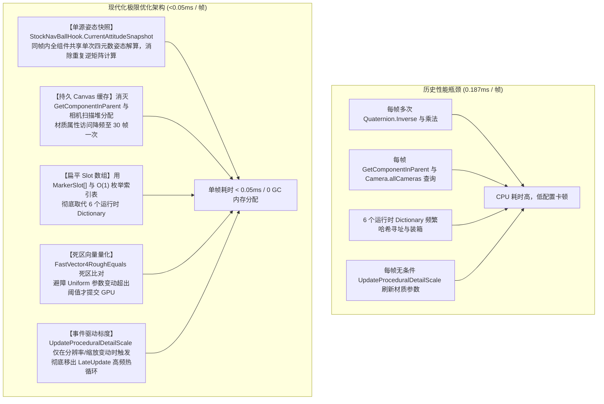
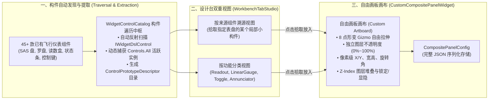
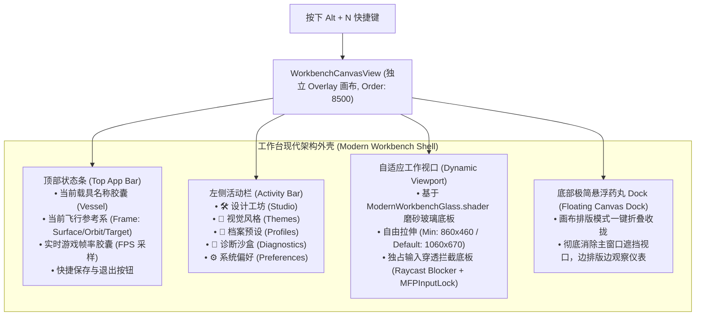
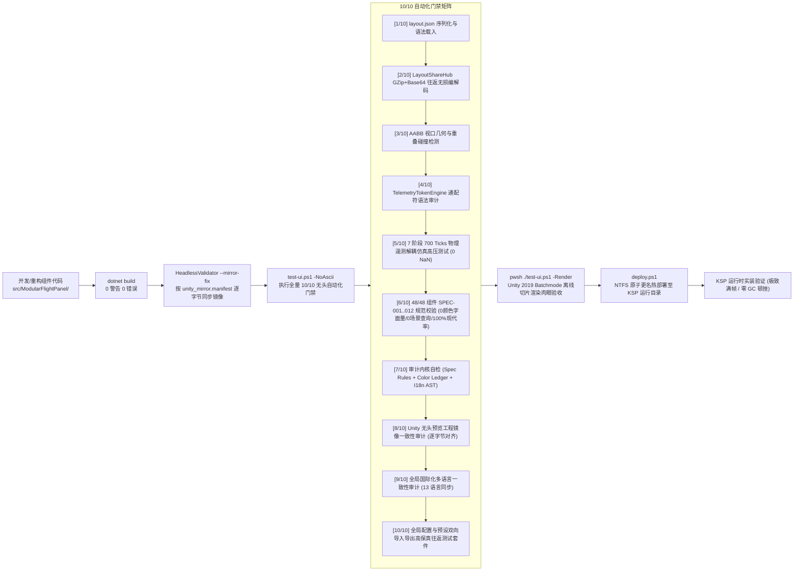

# Modular Flight Panel (MFP) 全景架构蓝图 (Architecture Blueprint v3.0)

> **Modular Flight Panel (MFP)** 是面向 **坎巴拉太空计划 1 (KSP1 1.12.x)** 与 **Unity 2019.4 LTS** 的全新一代高度解耦、全模块化、六中枢协同、100% 业务大脑与纯值快照解耦、支持自由画板搭建与 GPU 硬件加速的现代化飞行航电仪表系统。

---

## 1. 核心架构全景鸟瞰图 (Master System Panorama v3.0)

MFP 架构打破了传统 KSP 插件"单个脚本混杂物理采样与 UI 绘制"的混沌模式，自底向上构建了**九层解耦、六中枢协同、双轨时钟驱动**的工业级航电体系：

```mermaid
flowchart TD
    %% ── 外部与原生输入层 ──
    subgraph L0["一、底层游戏运行时与原生拦截网格 (Runtime & Stock Interception)"]
        KSP_Core["KSP 物理与轨道内核<br/>(Vessel, Orbit, FlightGlobals, CelestialBody)"]
        KSP_Events["KSP 事件总线<br/>(onVesselWasModified, onStageActivate, onVesselChange)"]
        Hooks["原生拦截网格 (Core/Hooks)<br/>• Harmony 运行时补丁 (HarmonyPatches)<br/>• 姿态球单源快照拦截 (StockNavBallHook & NavballAttitudeSnapshot)<br/>• 原生姿态球无感隐藏 (StockUIHider)<br/>• 分级图标/动作拦截 (StockStageActionHook)<br/>• 原生工具栏注入 (StockToolbarHook & MFPToolbarButton)<br/>• 对接口物理锚点追踪 (DockAnchorTracker)"]
    end

    %% ── 外部探针与容灾层 ──
    subgraph L1["二、外部模组探针网络与容灾隔离 (External Probes & Resilience)"]
        ExternalMods["15 大外部航电/物理模组<br/>(FAR, KER, MechJeb, Principia, RealFuels, Kerbalism,<br/>RealAntennas, Trajectories, SystemHeat, DBSI, RP-1, GPWS 等)"]
        ProbeTraverser["跨程序集安全反射遍历器<br/>(ProbeReflectionTraverser)"]
        ProbeMgr["探针中枢 (TelemetryProbeManager)<br/>• 3秒双重排队冷却队列<br/>• 连续5次异常自动熔断 (Circuit Breaker)<br/>• 736+ 参数统一契约映射"]
        SimEngine["离线高压仿真引擎 (TelemetrySimulationEngine)<br/>(7 飞行阶段 / 700 Ticks 纯 C# 离线注水)"]
    end

    %% ── 核心六中枢网格 ──
    subgraph L2["三、核心六中枢协同网格 (Core Six-Pillars Mesh)"]
        Pillar1["【中枢 1: 动力学与遥测中枢】<br/>TelemetryHub [Order: -500]<br/>• IFlightTelemetry 纯 C# 契约解耦<br/>• 分部动力学解算 (Dynamics, Propulsion, Subsystems, Maneuver)<br/>• 差分电量与资源网络总计优化"]

        Pillar2["【中枢 2: 全局物理量纲与单位换算中枢】<br/>AvionicsUnitSystem<br/>• 7 大物理量纲 (速度/高度/升降/气压/质量/温度/距离)<br/>• 4 大全局制式 (公制 SI / 英制航空 / 混合航空 / 航海制)<br/>• 0 GC 快速转换与阶梯自适应工程格式化 (FormatAdaptive)"]

        Pillar3["【中枢 3: 外部探针协调中枢】<br/>ExternalProbeRegistry<br/>• 探针动态参数目录映射<br/>• 软反射与异常降级隔离 (NaN/Missing -> 占位符 '---')"]

        Pillar4["【中枢 4: 统一缓存与零 GC 中枢】<br/>CacheManager (Unified Caching Hub)<br/>• P1: 静态整数/百分比/度数常量表 + 浮点死区量化池<br/>• P2: 载具拓扑与推力事件驱动缓存 (滑行0开销)<br/>• P3: 目标交会对接 15Hz 平滑一阶外推<br/>• P4: 主题色彩连续内存扁平直查 (O(1) 直读)<br/>• 探针同帧快照防重缓存 (Probe Frame Cache)"]

        Pillar5["【中枢 5: 双轨时钟与分级调度中枢】<br/>WidgetRenderManager<br/>• 低频心跳驱动 (HeartBeatTier: 10Hz 物理解算)<br/>• 高频渲染分发 (RefreshTier: 60Hz UI 绘制)<br/>• 满帧直通授权 (AlwaysFullPower 豁免帧预算)<br/>• 视口可见性裁剪 (Viewport Culling) 与 GraphicRaycaster 动态休眠"]

        Pillar6["【中枢 6: 样式与着色管道中枢】<br/>WidgetStyleManager & ThemeManager<br/>• SPEC-006 零颜色字面量 (语义调色板驱动)<br/>• 16 款出厂高精主题预设 (B787 / 龙飞船 / 赛博 / 阿波罗等)<br/>• 15 款专属 GPU Shader 材质复用缓存池"]
    end

    %% ── 遥测求值与通道解析 ──
    subgraph L3["四、通配符求值与通道解析引擎 (Telemetry Token & Channel Engine)"]
        TokenEngine["通配符求值器 (TelemetryTokenEngine)<br/>• 62 个原生 Tag + 736 个外部探针 Token<br/>• 正则段模板解析 {TAG:SUB:FMT}<br/>• 向量分量与量纲安全格式化"]
        ChannelParser["组件通道契约解析器 (BaseFlightWidget Channels)<br/>• 键值对 DSL (KEY=VALUE;...)<br/>• 类型化安全解析 (Double/Float/Int/Bool)<br/>• 多别名优先提取与默认值回退"]
    end

    %% ── 业务大脑与纯值快照 ──
    subgraph L4["五、业务大脑与纯值状态快照 (Decoupled Logic & Value Snapshots)"]
        LogicBase["【业务大脑基类】WidgetLogic&lt;TState&gt;<br/>• 纯 C# 无引擎依赖 (0 UnityEngine 引用)<br/>• 100% 离线无头单测覆盖<br/>• Evaluate(telemetry, dt) 集中运算"]
        StateSnap["【纯值快照】struct TState (0 GC)<br/>• 只读状态交付，严禁堆分配<br/>• 线程安全与时间旅行回放基础"]
        Router["【通用交互路由】WidgetInteractionRouter<br/>• 全组件标配右键上下文菜单 (锁定/复位/不透明度/切制式/探针速览)<br/>• 专属动作声明 (RegisterAction) 与双击/悬浮交互"]
    end

    %% ── 自由搭建模版与构件库 ──
    subgraph L5["六、自由航电搭建模版与构件目录中枢 (Freeform Studio & Control Catalog)"]
        Catalog["【构件遍历中枢】WidgetControlCatalog<br/>• 自动反射提取 45+ 款组件内微控件<br/>• 按来源溯源与按功能分类双重视图<br/>• 动态导出 ControlPrototypeDescriptor"]
        FreeformPanel["【自由画板组件】CustomCompositePanelWidget<br/>• 对标 Photoshop 图层管理与 8 点形变拉伸<br/>• 独立图层不透明度 (0%~100%) 与旋转<br/>• CompositePanelConfig 完整 JSON 序列化"]
        MicroDSL["声明式微控件容器 (WidgetControlContainer)<br/>• TextWidget (Title / Badge / Value / Unit 语义泊靠)<br/>• LinearBarWidget (自动归一化进度条)<br/>• ToggleButtonWidget / ActionButtonWidget (防抖交互键)<br/>• AvionicsSegmentedControl / Annunciator / Tooltip"]
    end

    %% ── 48 个全量航电组件族 ──
    subgraph L6["七、五大标准化航电组件族 (48 Specialized Flight Widgets - 100% 现代化)"]
        W_Nav["【姿态与轨道导航族 - 11 个】<br/>NavballSphereWidget (&lt;0.05ms 优化 3D 球) / RectangularNavballWidget (3D 矩形框)<br/>VesselAttitudeSphereWidget / HeadingArcWidget / NDNavigationWidget<br/>SASDialWidget / OrbitalElementsWidget / ReferenceFrameWidget<br/>ManeuverNodeWidget / ManeuverNodeWidgetv2 / ManeuverTimelineWidget"]

        W_Gauges["【表盘与带状仪表族 - 6 个】<br/>TapeGaugeWidget (双速/高度带) / ArcTapeWidget (弧形滚带)<br/>AvionicsBarGaugeWidget / ArcMeterWidget (弧形推力/VSI)<br/>CustomTokenTextWidget (自由通配卡) / CustomCompositePanelWidget (自由画板)"]

        W_SpaceX["【SpaceX 龙飞船与星舰航电族 - 8 个】<br/>SpaceXDockingReticleWidget (ISS 对接光标) / SpaceXAttitudeWidget<br/>SpaceXOverviewWidget / SpaceXHeaderWidget / SpaceXBottomBarWidget<br/>SpaceXTimelineWidget / SpaceXEngineWidget / SpaceXArcGaugeWidget"]

        W_Systems["【飞船系统与工程监视族 - 14 个】<br/>ElectricalSystemWidget / LifeSupportWidget / Rocket2DWidget<br/>SignalStatusWidget / CommSignalWidget / CommSignalWidgetv2<br/>EcamAlertLogWidget / MasterWarningWidget / TimeCommHubWidget<br/>B747EicasWidget / B747LowerEicasWidget / B787EicasWidget<br/>PerformanceMonitorWidget / StageDeltaVWidget"]

        W_Controls["【控制台与交互操纵族 - 8 个】<br/>StageControlWidget (分级防误触锁) / StagingSequenceWidget<br/>BottomControlsWidget / ModernToolbarWidget / FavoriteToolbarWidget<br/>TimeWarpWidget / UIWidget / BaseFlightWidget 基类"]
    end

    %% ── 现代工作台与交互设计 ──
    subgraph L7["八、现代航电暗晶工程工作台 3.0 (Alt+N Cyber-Dark Workbench)"]
        ModernWorkbench["【全 UGUI + GPU 磨砂玻璃工作台】WorkbenchCanvasView<br/>• ModernWorkbenchGlass.shader 硬件加速暗晶毛玻璃<br/>• 彻底告别 IMGUI，实现 0 GC、0 掉帧与平滑拖拽<br/>• 顶部实时遥测胶囊 (Vessel, Frame, FPS)<br/>• 底部极简悬浮药丸 Dock (排版模式彻底消除视口遮挡)"]

        Tabs["5 大现代 IDE 级工作视口 (IWorkbenchTabView)<br/>• WorkbenchTabStudio: 自由画板搭建、构件库选取、图层管理与属性面板<br/>• WorkbenchTabThemes: 16 款主题热切、15 款 Shader 选用与调色板定制<br/>• WorkbenchTabProfiles: 载具专属预设绑定、备份还原与 GZip+Base64 分享码<br/>• WorkbenchTabDiagnostics: 实时微秒级采样大盘、Top Offender 诊断与遥测沙盒<br/>• WorkbenchTabPreferences: 全局缩放、DPI 自适应、节能模式与按键定制"]
    end

    %% ── 质量门禁与工具链 ──
    subgraph L8["九、质量保障门禁与 CI 工具链 (Quality Gates & Toolchain)"]
        RoslynAudit["【Roslyn AST 静态门禁】UI/Auditing<br/>• SPEC-001..012 共 15 条架构铁律全项检验<br/>• L4 真实符号语义与常量折叠 (链接 18 个程序集)<br/>• 零颜色字面量、零场景查询、智能私有缓存与死区验证"]
        Validator["【10/10 无头自动化门禁套件】tools/HeadlessValidator<br/>• 双向配置往返测试 / 视口防碰撞 / 7阶段动力学注水仿真 / I18n多语言对齐"]
        BatchRender["【Unity 离线切片渲染】test-ui.ps1 -Render<br/>• Unity 2019 Batchmode 离线像素级肉眼验收"]
        Deploy["【NTFS 热部署】deploy.ps1<br/>• 原子更名安全替换游戏运行目录 DLL"]
    end

    %% ── 核心流向依赖线 ──
    KSP_Core --> Hooks
    KSP_Events --> Hooks
    Hooks --> Pillar1
    ExternalMods --> ProbeTraverser --> ProbeMgr --> Pillar3
    SimEngine -.->|离线高压测试| Pillar1

    Pillar1 -->|IFlightTelemetry| Pillar2
    Pillar2 --> L3
    Pillar1 & Pillar3 --> TokenEngine
    TokenEngine --> ChannelParser

    L3 --> LogicBase
    LogicBase --> StateSnap
    StateSnap --> L6

    L6 <--> Router
    L6 <--> MicroDSL
    L6 <--> Catalog --> FreeformPanel
    L6 <--> ModernWorkbench
    ModernWorkbench --> Tabs

    L6 --- RoslynAudit
    RoslynAudit --- Validator
    Validator --- BatchRender --> Deploy
```



---

## 2. 核心六中枢协同拓扑 (Core Six-Pillars Mesh)

MFP 航电系统的核心运转建立在六大相互解耦、权责明确的中枢网格之上：

| 中枢代号 | 中枢名称 | 核心实现文件 | 职责与技术边界 |
| :-- | :-- | :-- | :-- |
| **中枢 1** | **动力学与遥测中枢** | [`TelemetryHub.cs`](file:///c:/Users/43701/Documents/github/KSP_naviball/src/ModularFlightPanel/Core/Telemetry/TelemetryHub.cs) | 挂载于 KSP 执行序早期 (`Order: -500`)，以纯 C# 契约 [`IFlightTelemetry`](file:///c:/Users/43701/Documents/github/KSP_naviball/src/ModularFlightPanel/Core/Contracts/IFlightTelemetry.cs) 隔离引擎，拆分为 Dynamics / Propulsion / Subsystems / OrbitManeuver 四大分部解算，并针对滑行阶段推力与质量进行事件驱动缓存。 |
| **中枢 2** | **全局物理量纲中枢** | [`AvionicsUnitSystem.cs`](file:///c:/Users/43701/Documents/github/KSP_naviball/src/ModularFlightPanel/Core/Avionics/AvionicsUnitSystem.cs) | 统一接管全座舱物理换算，覆盖 7 大物理量纲（长度、速度、高度、垂直速度、动压、质量、温度）与 4 种全局制式（公制 SI、英制航空、混合航空、航海制），支持零 GC 换算与阶梯自适应工程格式化（如 `1200m -> 1.2km`，`45000ft -> 45.0kft`）。 |
| **中枢 3** | **外部探针协调中枢** | [`TelemetryProbeManager.cs`](file:///c:/Users/43701/Documents/github/KSP_naviball/src/ModularFlightPanel/Core/Probes/TelemetryProbeManager.cs) | 纳管 FAR、KER、MechJeb、Principia 等 15 大模组共 736+ 参数。内置 3 秒双重排队冷却队列与连续 5 次异常自动熔断（Circuit Breaker），未安装或返回 `NaN` 时优雅降级为 `"---"`。 |
| **中枢 4** | **统一缓存与零 GC 中枢** | [`CacheManager.cs`](file:///c:/Users/43701/Documents/github/KSP_naviball/src/ModularFlightPanel/Core/Diagnostics/CacheManager.cs) | **P1**: 静态整数 (-1000..9999)、百分比 (0%..100%)、度数 (0°..360°) 常量池与浮点死区量化池；<br/>**P2**: 载具拓扑与推力事件驱动缓存（滑行 0 开销）；<br/>**P3**: 目标交会对接 15Hz 物理采样 + 一阶平滑外推；<br/>**P4**: 主题色彩扁平数组直接寻址 ($O(1)$ 纳秒直读)；探针同帧快照去重。 |
| **中枢 5** | **双轨调度中枢** | [`WidgetRenderManager.cs`](file:///c:/Users/43701/Documents/github/KSP_naviball/src/ModularFlightPanel/UI/Framework/WidgetRenderManager.cs) | 双轨生命周期调度：`OnDataHeartBeat`（10Hz 低频物理推算）与 `OnUIDrawLoop`（60Hz 高频视图绘制）；支持 4 级刷新阶梯（Critical / Standard / Relaxed / UltraLow）与源码级精确 `CustomHz`；视口剔除与射线按需休眠。 |
| **中枢 6** | **样式与着色管道中枢** | [`WidgetStyleManager.cs`](file:///c:/Users/43701/Documents/github/KSP_naviball/src/ModularFlightPanel/UI/Framework/WidgetStyleManager.cs) | 践行 SPEC-006 零颜色字面量红线，通过语义角色（`CardStyleRole`, `TextStyleRole`, `MeterStyleRole`）解析颜色；管理 16 款内置主题与 15 款专属 GPU Shader 材质复用池。 |

---

## 3. 双轨生命周期与业务大脑解耦机制 (Dual-Loop & WidgetLogic Pipeline)

为彻底消灭“物理采样与 UI 绘制混杂导致的帧率撕裂与 GC 顿挫”，MFP 实施了严格的**“大脑解耦、双轨调度、纯值快照”**管道：

```mermaid
sequenceDiagram
    autonumber
    participant KSP as KSP Physics / Unity
    participant TH as TelemetryHub<br/>[Pre-Update -500]
    participant WRM as WidgetRenderManager<br/>(双轨分发中枢)
    participant WL as WidgetLogic<TState><br/>(纯 C# 业务大脑)
    participant SNAP as struct TState<br/>(0 GC 状态快照)
    participant W as BaseFlightWidget<br/>(UGUI 视图容器)
    participant SUI as SmartUIExtensions<br/>(零开销脏检)

    Note over KSP,SUI: ══ 轨 1: 低频数据心跳循环 (OnDataHeartBeat - 如 10Hz) ══
    KSP->>TH: Update() (收集原生状态与探针数据)
    WRM->>WRM: 判定心跳步长 (HeartBeatTier / EffectiveHeartBeatInterval)
    opt 达到数据心跳时间戳
        WRM->>W: OnDataHeartBeat(in context)
        W->>WL: LogicCore.Evaluate(telemetry, dt)
        WL->>WL: 纯数学/物理推演 + AvionicsUnitSystem 统一量纲换算
        WL->>SNAP: 构造并存储只读状态快照 (CurrentState = new TState)
        Note over WL,W: 纯算物理，绝不访问任何 UnityEngine.UI 元素
    end

    Note over KSP,SUI: ══ 轨 2: 高频 UI 绘制循环 (OnUIDrawLoop - 如 60Hz) ══
    KSP->>WRM: LateUpdate() (游戏画面渲染前夕)
    WRM->>WRM: 判定画面刷新步长 (RefreshTier / Viewport Culling 检查)
    opt 达到显示刷新时间戳 且 位于视口可见区域
        WRM->>W: OnUIDrawLoop(ref context)
        W->>W: OnRenderState() (只读提取 _logic.CurrentState)
        W->>SUI: Cached<T>.Update(state.Value) 防抖脏检
        opt 数据发生有效跳变 (超出死区容差)
            SUI->>W: SetTextSafe / SetBarFillSafe 写入 UGUI 缓冲区
        else 保持微小抖动内
            SUI-->>W: 阻断 UGUI 重建 (0 顶点重绘 / 0 堆分配)
        end
        Note over W,SUI: 纯读状态，绝不重新查询遥测或计算物理
    end
```

### 核心契约原则：
1. **`HeartBeatTier` 频率必须 $\le$ `RefreshTier` 频率 (SPEC-002B)**：数据心跳不能快于画面刷新率，杜绝无效解算。
2. **纯值快照结构体 (`struct TState`, SPEC-010/012)**：必须为只读纯值结构体，严禁在状态中包含 `class` 引用或在每帧 `new` 引用对象。
3. **100% 离线无头测试性**：`WidgetLogic<TState>` 完全不引用 `UnityEngine`，可在 `HeadlessValidator` 中注入任何遥测假数据进行纯 CPU 毫秒级单测。

---

## 4. 3D 姿态球超极限渲染优化管线 (0.05ms Pipeline)

姿态球作为航电系统的心脏，经历了从传统 0.187ms 密集开销到 `<0.05ms` 的极限性能重构：



---

## 5. 自由航电搭建工坊与构件中枢 (Freeform Studio & Control Catalog)

MFP 提供了完全对标 Photoshop / Figma 体验的自由航电设计工坊：



- **构件任意提取**：无需重新编写组件，直接从波音 747 EICAS、SpaceX 龙飞船或底控台中“抠出”任意指示灯、进度条或读数键，拖入画板自由组合；
- **Photoshop 级图层系统**：每个子图层（`CompositeElementConfig`）拥有独立的绝对坐标、尺寸、旋转、不透明度、绑定 Token、警告门限与动作行为；
- **统一解耦大脑**：画板由 [`CompositePanelLogic.cs`](file:///c:/Users/43701/Documents/github/KSP_naviball/src/ModularFlightPanel/Core/Avionics/CompositePanelLogic.cs) 统一驱动，0 GC 评估并驱动所有动态子图层。

---

## 6. 现代航电暗晶工程工作台 3.0 (Alt+N Cyber-Dark Workbench)

彻底弃用 Unity 历史遗留 IMGUI，全量迁移至基于 UGUI + GPU 磨砂玻璃 Shader 的现代工程工作台：



### 5 大核心工作视口：
1. **🛠️ 航电设计工坊 ([`WorkbenchTabStudio`](file:///c:/Users/43701/Documents/github/KSP_naviball/src/ModularFlightPanel/UI/Workbench/Tabs/WorkbenchTabStudio.cs))**：
   - 包含自由画板搭建（图层树、构件库、属性检查器）与屏幕已有组件管理；
   - 支持一键进入画布排版模式、网格磁吸（Grid Snapping）与辅助线吸附。
2. **🎨 视觉风格与主题 ([`WorkbenchTabThemes`](file:///c:/Users/43701/Documents/github/KSP_naviball/src/ModularFlightPanel/UI/Workbench/Tabs/WorkbenchTabThemes.cs))**：
   - 16 款出厂高精主题无缝热切换；
   - 15 款专用 GPU Shader 材质预览与选用；
   - 字体样式切换（现代平滑矢量 / 硬件复古点阵）与语义调色板微调。
3. **💾 档案与预设中枢 ([`WorkbenchTabProfiles`](file:///c:/Users/43701/Documents/github/KSP_naviball/src/ModularFlightPanel/UI/Workbench/Tabs/WorkbenchTabProfiles.cs))**：
   - 载具专属布局自动绑定（按 Vessel 类型/名称加载）；
   - 出厂航电预设库（波音、阿波罗、深空探针、SpaceX 等）一键还原；
   - 社区分享码（`MFP:v1:...` GZip+Base64）无损往返编解码与导入导出。
4. **🚀 诊断与遥测沙盒 ([`WorkbenchTabDiagnostics`](file:///c:/Users/43701/Documents/github/KSP_naviball/src/ModularFlightPanel/UI/Workbench/Tabs/WorkbenchTabDiagnostics.cs))**：
   - 微秒级性能大盘采样（Telemetry / Widgets / Rendering 耗时与 GC 节约）；
   - 7 阶段 700 Ticks 离线动力学注水仿真与报警演练；
   - 62 原生 Tag + 736 外部探针参数实时查表器。
5. **⚙️ 系统偏好与按键 ([`WorkbenchTabPreferences`](file:///c:/Users/43701/Documents/github/KSP_naviball/src/ModularFlightPanel/UI/Workbench/Tabs/WorkbenchTabPreferences.cs))**：
   - 全局尺寸比例（0.7x ~ 2.0x）与 DPI 缩放模式；
   - 节电模式（Eco Saver）与心跳基准频率调节；
   - 音频反馈（点击音效）开关与快捷键重映射；
   - 13 种语言包实时切换。

---

## 7. 着色器材质矩阵与离屏烘焙管线 (Shaders & Rendering Pipeline)

MFP 自研了 15 款专有高清晰度着色器，全部由 `MaterialPool` 实行零冗余管理：

```mermaid
flowchart LR
    subgraph UI_Shaders["15 款专有 GPU 航电着色器矩阵"]
        direction TB
        S1["ModernWorkbenchGlass.shader (现代暗晶工作台毛玻璃/色散/边缘光)"]
        S2["AvionicsProceduralUI.shader (无纹理程序化圆角、细线与边框)"]
        S3["CrispAvionicsText.shader (高对比度抗锯齿矢量航电字体)"]
        S4["DigitalSegmentUI.shader (荧光管 7 段数码液晶管)"]
        S5["DotMatrixUI.shader (物理点阵 / LED 荧光屏示波器)"]
        S6["GlassCockpitUI.shader (现代玻璃座舱微光与漫反射)"]
        S7["NeonGlowUI.shader (赛博霓虹脉冲发光管)"]
        S8["PhosphorHoloUI.shader (衍射全息绿/琥珀色磷光 CRT 扫描线)"]
        S9["RadialSegmentedMeter.shader (多段式圆弧刻度标尺与动态范围)"]
        S10["MinimalistAttitudeSphere.shader (极简扁平态势球)"]
        S11["NavballModern.shader (现代梯度天顶/俯仰刻度梯/菲涅尔光)"]
        S12["NavballHalftone.shader (屏幕空间点阵半色调 Dither 渐变)"]
        S13["NavballRaymarch.shader (纯数学光线投射 3D 姿态球直出)"]
        S14["NavballEnhanced.shader (高保真增强型原版贴图着色器)"]
        S15["Vessel3DTechnical.shader (载具 3D 线框技术透视渲染)"]
    end

    subgraph OffscreenBakers["离屏几何烘焙与渲染管道"]
        direction TB
        B1["NavballSphereWidget (独立离屏 Camera + 3D 球体 + RenderTexture)"]
        B2["VesselSilhouetteBaker (载具网格正交投影生成 2D 轮廓矢量)"]
        B3["Vessel3DBaker (载具 3D 线框技术透视 Technical3D)"]
        B4["ReferenceFrameIconAtlasGenerator (天体与参考系矢量图集动态生成)"]
        B5["SASDialVisualGenerator (SAS 罗盘程序化刻度与环形视效)"]
    end

    UI_Shaders --> MaterialPool["材质复用池 (MaterialPool)<br/>按主题色彩与变体零冗余复用"]
    MaterialPool --> CanvasRender["UGUI 最终画板呈现"]
    OffscreenBakers --> CanvasRender
```



---

## 8. SPEC 架构铁律与门禁红线全集 (SPEC Core Matrix 全集)

所有航电小组件必须 100% 遵从 [`WidgetSpecRules.cs`](file:///c:/Users/43701/Documents/github/KSP_naviball/src/ModularFlightPanel/UI/Auditing/WidgetSpecRules.cs) 单点声明的 **15 大架构铁律**：

| 规则码 | 规范契约 | 核心要求与匹配判定 | 违规后果 |
| :-- | :-- | :-- | :-- |
| **MFP-SPEC-001** | **统一继承契约** | 必须直接派生自 `BaseFlightWidget`，杜绝多层派生与无关自定义基类 | 门禁报 ERROR |
| **MFP-SPEC-002** | **刷新率契约** | 显式重写 `RefreshTier` (或精确 `CustomHz`)；满帧阶梯 `Critical` 必须标注 `HighFrequency = true` | 门禁报 ERROR |
| **MFP-SPEC-002B**| **心跳阶梯契约** | `HeartBeatTier` 频率必须 $\le$ `RefreshTier` 频率，严禁数据心跳反向倒挂高于渲染率 | 门禁报 ERROR |
| **MFP-SPEC-003** | **语义主题管道** | 若显式声明 `ApplyTheme`，签名必须符合规范且必须调用 `base.ApplyTheme(theme)` | 门禁报 ERROR |
| **MFP-SPEC-004** | **遥测驱动契约** | 读数与文案 100% 由 `TelemetryTokenEngine` 驱动；**严禁臆造参数，必须查表接入** | 门禁报 ERROR |
| **MFP-SPEC-004C**| **独立数据心跳** | 显式重写 `OnDataHeartBeat`（或挂载大脑），所有遥测解算/物理计算收拢在此，**严禁写 UI** | 门禁报 ERROR |
| **MFP-SPEC-004D**| **独立 UI 绘制** | 显式重写 `OnUIDrawLoop`（或 `OnRenderState`），所有 UGUI 渲染与脏检收拢在此，**严禁算物理** | 门禁报 ERROR |
| **MFP-SPEC-005** | **安全生命周期** | 若显式声明 `OnDestroy`，必须为 `protected override void OnDestroy()` 并调用 `base.OnDestroy()` | 门禁报 ERROR |
| **MFP-SPEC-006** | **零裸颜色字面量** | **零容忍**：严禁 `new Color(...)` 或 `Color.white/red`（透明 `Color.clear` 除外），统一经由 `WidgetStyleManager` 语义取色 | 门禁报 ERROR |
| **MFP-SPEC-007** | **零场景查询** | **零容忍**：严禁 `FindObjectOfType` / `GameObject.Find` / `Camera.main`，统一走 `IFlightTelemetry` | 门禁报 ERROR |
| **MFP-SPEC-008** | **声明式自动注册** | 必须标注 `[FlightWidget("type_id", ...)]` 元数据，由 `WidgetRegistry` 自动装配进仪表库 | 门禁报 ERROR |
| **MFP-SPEC-009** | **智能私有缓存** | **禁止手写 `_lastXxx` 裸字段**；必须使用 `Cached<T>` / `DirtyField<T>` 或 `SmartUIExtensions` | 门禁报 ERROR |
| **MFP-SPEC-010** | **热循环无守卫操作**| 高频生命周期禁止无守卫堆分配（`new` 闭包/容器）、字符串插值与非脏检 UGUI 几何赋值 | 门禁报 ERROR |
| **MFP-SPEC-011** | **内部空间防碰撞** | 禁止组件内部微控件、图元与文本发生几何坐标重叠与视觉遮挡冲突 (Spatial Collision) | 门禁报 ERROR |
| **MFP-SPEC-012** | **业务大脑契约** | 必须重写 `protected override IWidgetLogic LogicCore => ...` 挂载大脑，底层状态快照必须为 0 GC 结构体 (`struct TState`) | 门禁报 ERROR |
| **MFP-WARN-TELEM**| **标准化遥测装配** | 注册微控件（如 `WidgetReadoutControl`）或声明 `TextWidget.Value()` 时必须传入有效默认 Token | 门禁报 WARNING |

---

## 9. 48 个全量航电小组件谱系总表 (Complete 48-Widget Taxonomy)

仓库内全部 48 个航电组件类现已 **100% 达成架构现代化**（全部挂载 `WidgetLogic<TState>` 解耦大脑，0 违规，0 遗留旧版）：

| 序号 | 分类大类 | 组件类名 | 注册 ID | 刷新阶梯 | 心跳阶梯 | 业务大脑类名 | 核心功能与亮点 |
| :--: | :-- | :-- | :-- | :-- | :-- | :-- | :-- |
| 1 | **导航** | `NavballSphereWidget` | `core.navball` | Critical (满帧) | Critical | `NavballSphereLogic` | 3D 姿态球、离屏相机渲染、`<0.05ms` 极速 Slot 渲染 |
| 2 | **导航** | `RectangularNavballWidget` | `nav.rectangular_navball`| Critical (满帧) | Critical | `RectangularNavballLogic` | 现代矩形平显 3D 姿态框、航向带与俯仰梯投影 |
| 3 | **导航** | `VesselAttitudeSphereWidget`| `nav.vessel_navball` | Standard (60Hz) | Relaxed (10Hz) | `VesselAttitudeSphereLogic` | 载具姿态指示球与三维空间矢量投影 |
| 4 | **导航** | `HeadingArcWidget` | `core.heading_arc` | Critical (满帧) | Relaxed (10Hz) | `HeadingArcLogic` | 现代平显航向指示圆弧 (PFD 核心) |
| 5 | **导航** | `NDNavigationWidget` | `custom.nd_navigation` | Standard (60Hz) | Relaxed (10Hz) | `NDNavigationLogic` | 综合水平态势导航罗盘、航点与交会对接标识 |
| 6 | **导航** | `SASDialWidget` | `core.sas_dial` | Standard (60Hz) | Relaxed (10Hz) | `SASDialLogic` | 环形 SAS 罗盘、程序化刻度与多态指向环 |
| 7 | **导航** | `OrbitalElementsWidget` | `nav.orbital_elements` | Relaxed (10Hz) | Relaxed (10Hz) | `OrbitalElementsLogic` | 轨道六根数精准解析、半长轴与离心率卡片 |
| 8 | **导航** | `ReferenceFrameWidget` | `nav.reference_frame` | Relaxed (10Hz) | Relaxed (10Hz) | `ReferenceFrameLogic` | 地表/轨道/目标参考系切换与天体标识徽标 |
| 9 | **导航** | `ManeuverNodeWidget` | `core.maneuver` | Standard (60Hz) | Relaxed (10Hz) | `ManeuverNodeLogic` | 变轨机动节点矢量分量与点火时长读数盒 |
| 10 | **导航** | `ManeuverNodeWidgetv2` | `core.maneuver_v2` | Standard (60Hz) | Relaxed (10Hz) | `ManeuverNodev2Logic` | 极简现代化机动节点卡片 (纯微控件 DSL) |
| 11 | **导航** | `ManeuverTimelineWidget` | `custom.maneuver_timeline` | Relaxed (10Hz) | Relaxed (10Hz) | `ManeuverTimelineLogic` | 机动时序时间线与节点倒计时进度标尺 |
| 12 | **表盘** | `TapeGaugeWidget` | `tape.speed` / `tape.alt` | Standard (60Hz) | Relaxed (10Hz) | `TapeGaugeLogic` | 双侧速度/气压高度物理滚带表 (带趋势矢量) |
| 13 | **表盘** | `ArcTapeWidget` | `custom.arc_speed_tape` | Standard (60Hz) | Relaxed (10Hz) | `ArcTapeLogic` | 弯曲弧形滚带表盘 (航电高端拟物) |
| 14 | **表盘** | `AvionicsBarGaugeWidget` | `gauge.throttle` | Standard (60Hz) | Relaxed (10Hz) | `AvionicsBarGaugeLogic` | 垂直多段式动力学柱状条 |
| 15 | **表盘** | `ArcMeterWidget` | `core.throttle` / `vsi` | Standard (60Hz) | Relaxed (10Hz) | `ArcMeterLogic` | 120°/180°/270° 圆弧刻度推力与垂直速度表 |
| 16 | **表盘** | `CustomTokenTextWidget` | `custom.*` | Standard (60Hz) | Relaxed (10Hz) | `CustomTokenTextLogic` | 自由通配符文本卡片 (支持多槽位与自定义格式) |
| 17 | **表盘** | `CustomCompositePanelWidget`| `custom.composite_panel`| Standard (60Hz) | Relaxed (10Hz) | `CompositePanelLogic` | **自由航电搭建画板** (PS级图层/8点形变/任意控件) |
| 18 | **SpaceX**| `SpaceXDockingReticleWidget`| `spacex.docking` | Critical (满帧) | Relaxed (10Hz) | `SpaceXDockingReticleLogic`| 龙飞船 ISS 对接光标 HUD (运动学平滑外推) |
| 19 | **SpaceX**| `SpaceXAttitudeWidget` | `spacex.attitude` | Critical (满帧) | Relaxed (10Hz) | `SpaceXAttitudeLogic` | 极简数字姿态三轴读数盒 (GPU 程序化图元) |
| 20 | **SpaceX**| `SpaceXOverviewWidget` | `spacex.overview` | Relaxed (10Hz) | Relaxed (10Hz) | `SpaceXOverviewLogic` | 综合全船状态轮廓看板与多系统健康摘要 |
| 21 | **SpaceX**| `SpaceXHeaderWidget` | `spacex.header` | Relaxed (10Hz) | Relaxed (10Hz) | `SpaceXHeaderLogic` | 顶部任务时钟 (T- / T+) 与天体运行状态条 |
| 22 | **SpaceX**| `SpaceXBottomBarWidget` | `spacex.bottom` | Relaxed (10Hz) | Relaxed (10Hz) | `SpaceXBottomBarLogic` | 触控式航电功能控制底栏 |
| 23 | **SpaceX**| `SpaceXTimelineWidget` | `spacex.timeline` | Relaxed (10Hz) | Relaxed (10Hz) | `SpaceXTimelineLogic` | 发射时序里程碑与任务推进阶段指示器 |
| 24 | **SpaceX**| `SpaceXEngineWidget` | `spacex.engines` | Standard (60Hz) | Relaxed (10Hz) | `SpaceXEngineLogic` | 9发/多发集群状态矩阵与室压监视 |
| 25 | **SpaceX**| `SpaceXArcGaugeWidget` | `spacex.arc` | Standard (60Hz) | Relaxed (10Hz) | `SpaceXArcGaugeLogic` | 龙飞船专属圆弧平滑表盘 |
| 26 | **系统** | `ElectricalSystemWidget` | `custom.electrical` | Relaxed (10Hz) | Relaxed (10Hz) | `ElectricalSystemLogic` | 电力拓扑图 (差分电量与资源网络总计) |
| 27 | **系统** | `LifeSupportWidget` | `custom.life_support` | Relaxed (10Hz) | Relaxed (10Hz) | `LifeSupportLogic` | 氧气/水/气压维生监视 (支持 Kerbalism) |
| 28 | **系统** | `Rocket2DWidget` | `custom.rocket` | Relaxed (10Hz) | Relaxed (10Hz) | `Rocket2DLogic` | 2D 分级轮廓剪影与级间状态指示 |
| 29 | **系统** | `SignalStatusWidget` | `custom.signal` | Relaxed (10Hz) | Relaxed (10Hz) | `SignalStatusLogic` | 深空通信天线指向与增益列表 |
| 30 | **系统** | `CommSignalWidget` | `core.comm_signal` | Relaxed (10Hz) | Relaxed (10Hz) | `CommSignalCapsuleLogic`| 通信速率、信号强度与丢包率监视 |
| 31 | **系统** | `CommSignalWidgetv2` | `core.comm_signal_v2` | Relaxed (10Hz) | Relaxed (10Hz) | `CommSignalLogic` | 现代柱状图通信信号监视卡 |
| 32 | **系统** | `EcamAlertLogWidget` | `core.ecam_alert_log` | Relaxed (10Hz) | Relaxed (10Hz) | `EcamAlertLogLogic` | 空客风格 ECAM 历史告警回溯日志记录器 |
| 33 | **系统** | `MasterWarningWidget` | `core.master_warning` | Critical (满帧) | Relaxed (10Hz) | `MasterWarningLogic` | 航空级主警告与主注意灯闪烁器 |
| 34 | **系统** | `TimeCommHubWidget` | `core.time_comm_hub` | Relaxed (10Hz) | Relaxed (10Hz) | `TimeCommHubLogic` | 时间与通信一体化微型集成仪表 |
| 35 | **系统** | `B747EicasWidget` | `custom.b747_eicas` | Standard (60Hz) | Relaxed (10Hz) | `B747EicasLogic` | 波音 747 主发动机参数指示 EICAS |
| 36 | **系统** | `B747LowerEicasWidget` | `custom.b747_lower_eicas`| Standard (60Hz) | Relaxed (10Hz) | `B747LowerEicasLogic` | 波音 747 辅助动力与控制面状态 EICAS |
| 37 | **系统** | `B787EicasWidget` | `custom.b787_eicas` | Standard (60Hz) | Relaxed (10Hz) | `B787EicasLogic` | 波音 787 综合航电发动机监视卡片 |
| 38 | **系统** | `PerformanceMonitorWidget` | `core.performance_monitor`| Relaxed (10Hz) | Relaxed (10Hz) | `PerformanceMonitorLogic`| 游戏实时帧率 (FPS) 与系统性能开销监视卡 |
| 39 | **系统** | `StageDeltaVWidget` | `core.stage_dv` | Relaxed (10Hz) | Relaxed (10Hz) | `StageDeltaVLogic` | 实时分级 $\Delta V$ 列表与分级控制条目 |
| 40 | **控制** | `StageControlWidget` | `core.stage_control` | Standard (60Hz) | Relaxed (10Hz) | `StageControlLogic` | 分级触发、倒计时与安全防误触锁 |
| 41 | **控制** | `StagingSequenceWidget` | `core.staging_sequence`| Standard (60Hz) | Relaxed (10Hz) | `StagingSequenceLogic` | 多级分离时序控制与级间延时监视器 |
| 42 | **控制** | `BottomControlsWidget` | `core.bottom_controls` | Standard (60Hz) | Relaxed (10Hz) | `BottomControlsLogic` | SAS / RCS / 参考系 / 齿轮 / 刹车快速切换底栏 |
| 43 | **控制** | `ModernToolbarWidget` | `core.toolbar` | Relaxed (10Hz) | Relaxed (10Hz) | `ModernToolbarLogic` | 悬浮功能呼出工具栏 (带折叠与图标收纳) |
| 44 | **控制** | `FavoriteToolbarWidget` | `core.dock_favorites` | Relaxed (10Hz) | Relaxed (10Hz) | `FavoriteToolbarLogic` | 玩家收藏小组件快速泊靠停靠坞 |
| 45 | **控制** | `TimeWarpWidget` | `core.time_warp` | Relaxed (10Hz) | Relaxed (10Hz) | `TimeWarpLogic` | 时间加速倍率步进控制器与物理加急开关 |
| 46 | **控制** | `UIWidget` | `core.ui_widget` | Relaxed (10Hz) | Relaxed (10Hz) | `UIWidgetLogic` | 通用 UI 容器与背景底板占位控件 |
| 47 | **抽象** | `BaseNavballSphereWidget` | - | - | - | - | 3D 姿态球通用抽象基类 |
| 48 | **模板** | `StandardFlightWidgetTemplate`| - | Standard (60Hz) | Relaxed (10Hz) | `WidgetLogic<TState>` | 官方标准黄金组件范本实现 |

---

## 10. 10/10 门禁验证与 CI 交付工具链 (Toolchain & Quality Gates)


