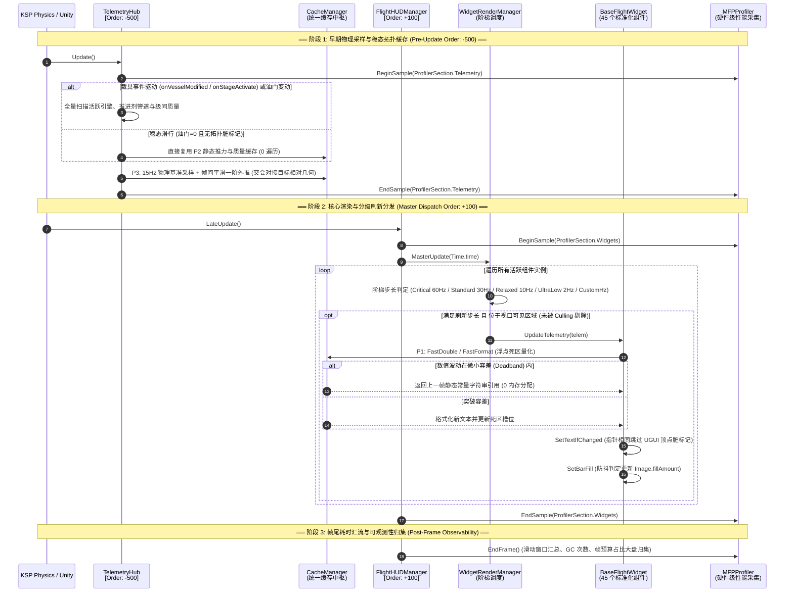
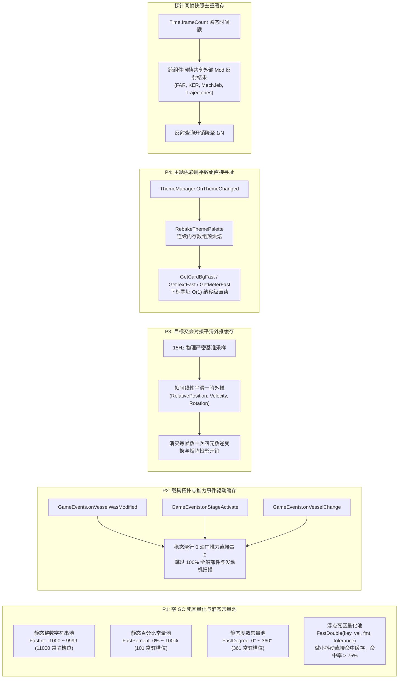
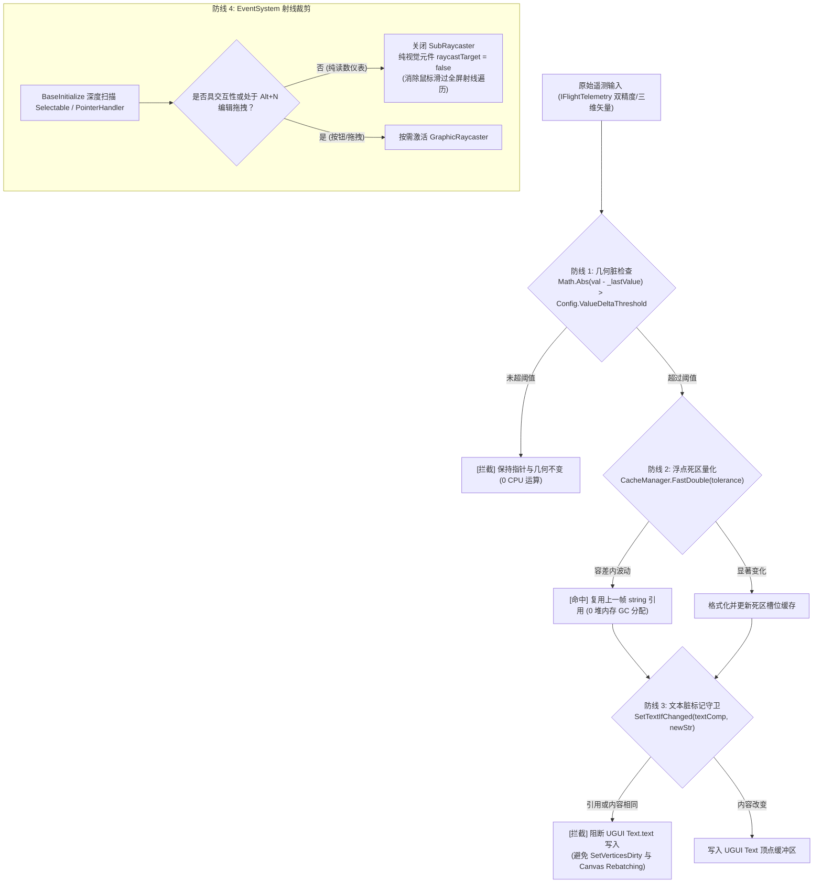
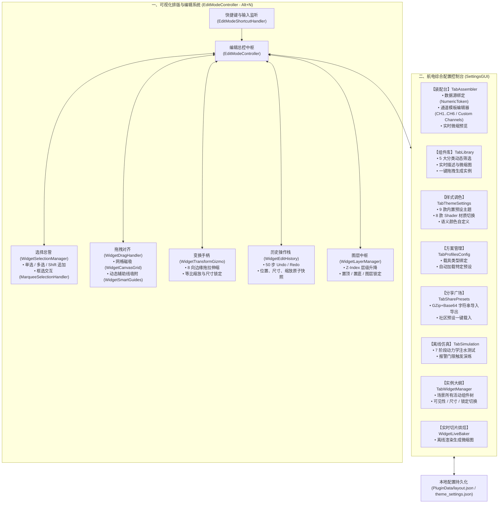
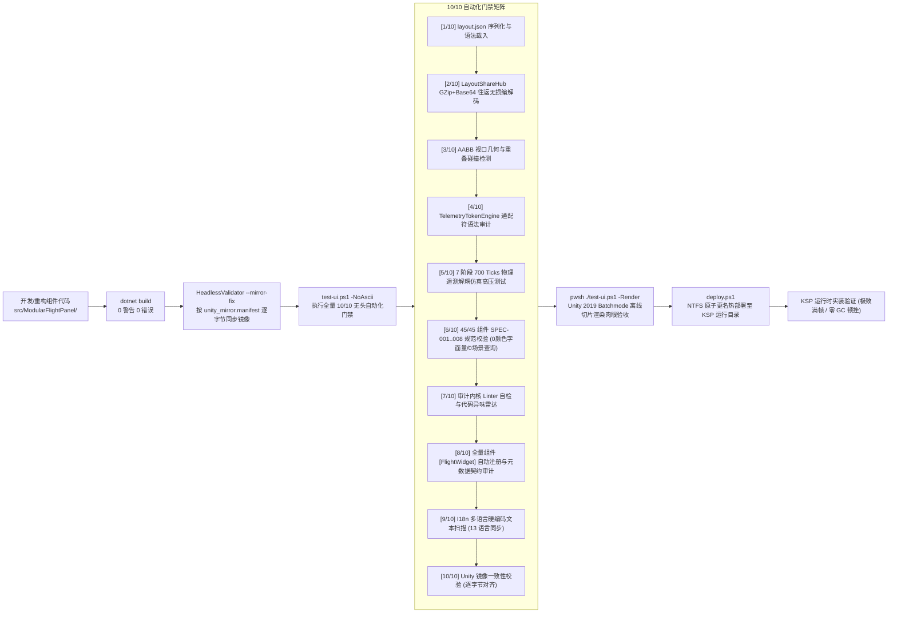

# Modular Flight Panel (MFP) 全景架构蓝图 (Architecture Blueprint v2.0)

> **Modular Flight Panel (MFP)** 是面向 **坎巴拉太空计划 1 (KSP1 1.12.x)** 与 **Unity 2019.4 LTS** 的下一代高度解耦、全模块化、五中枢协同、100% 数据与文案通配符双驱动的飞行航电仪表系统。

---

## 1. 核心架构全景鸟瞰图 (Master System Panorama)

MFP 架构打破了传统 KSP 插件"单个脚本混杂物理采样与 UI 绘制"的混沌模式，自底向上构建了**八层解耦、五中枢协同、双总线驱动**的工业级航电体系：

```mermaid
flowchart TD
    %% ── 外部与原生输入层 ──
    subgraph L0["一、底层游戏运行时与原生拦截网格 (Runtime & Stock Interception)"]
        KSP_Core["KSP 物理与轨道内核<br/>(Vessel, Orbit, FlightGlobals, CelestialBody)"]
        KSP_Events["KSP 事件总线<br/>(onVesselWasModified, onStageActivate, onVesselChange)"]
        Hooks["原生拦截网格 (Core/Hooks)<br/>• Harmony 运行时补丁 (HarmonyPatches)<br/>• 原生姿态球无感隐藏 (StockNavBallHook & StockUIHider)<br/>• 分级图标/动作拦截 (StockStageAction/IconHook)<br/>• 原生工具栏注入 (StockToolbarHook & MFPToolbarButton)<br/>• 对接口物理锚点追踪 (DockAnchorTracker)"]
    end

    %% ── 外部探针与容灾层 ──
    subgraph L1["二、外部模组探针网络与容灾隔离 (External Probes & Resilience)"]
        ExternalMods["15 大外部航电/物理模组<br/>(FAR, KER, MechJeb, Principia, RealFuels, Kerbalism,<br/>RealAntennas, Trajectories, SystemHeat, DBSI, RP-1, GPWS 等)"]
        ProbeTraverser["跨程序集安全反射遍历器<br/>(ProbeReflectionTraverser)"]
        ProbeMgr["探针中枢 (TelemetryProbeManager)<br/>• 3秒双重排队冷却队列<br/>• 连续5次异常自动熔断 (Circuit Breaker)<br/>• 736+ 参数统一契约映射"]
        SimEngine["离线高压仿真引擎 (TelemetrySimulationEngine)<br/>(7 飞行阶段 / 700 Ticks 纯 C# 离线注水)"]
    end

    %% ── 核心五中枢网格 ──
    subgraph L2["三、核心五中枢协同网格 (Core Five-Pillars Mesh)"]
        Pillar1["【中枢 1: 动力学与遥测中枢】<br/>TelemetryHub [Order: -500]<br/>• IFlightTelemetry 纯 C# 契约解耦<br/>• 分部动力学解算 (Dynamics, Propulsion, Subsystems, Maneuver)<br/>• 差分电量与资源总量解算"]
        
        Pillar2["【中枢 2: 外部探针协调中枢】<br/>ExternalProbeRegistry<br/>• 探针动态参数目录映射<br/>• 软反射与异常降级隔离"]

        Pillar3["【中枢 3: 统一缓存与零 GC 中枢】<br/>CacheManager (Unified Caching Hub)<br/>• P1: 静态整数/百分比/度数常量表 + 浮点死区量化池<br/>• P2: 载具拓扑与推力事件驱动缓存 (滑行0开销)<br/>• P3: 目标交会对接 15Hz 平滑一阶外推<br/>• P4: 主题色彩连续内存扁平直查 (O(1) 直读)<br/>• 探针同帧快照防重缓存 (Probe Frame Cache)"]

        Pillar4["【中枢 4: 分级渲染与调度中枢】<br/>WidgetRenderManager<br/>• 4 级刷新阶梯 (Critical 60Hz / Standard 30Hz / Relaxed 10Hz / UltraLow 2Hz)<br/>• 源码级精确 CustomHz 支持<br/>• 视口可见性裁剪 (Viewport Culling)<br/>• GraphicRaycaster 动态休眠治理"]

        Pillar5["【中枢 5: 样式与着色管道中枢】<br/>WidgetStyleManager & ThemeManager<br/>• SPEC-006 零颜色字面量 (语义调色板驱动)<br/>• 8 款 Shader 材质复用缓存池<br/>• 多风格切换 (点阵 / 全息 / 玻璃 / 霓虹 / 现代)"]
    end

    %% ── 遥测求值与通配符引擎 ──
    subgraph L3["四、通配符求值与通道解析引擎 (Telemetry Token & Channel Engine)"]
        TokenEngine["通配符求值器 (TelemetryTokenEngine)<br/>• 62 个原生 Tag + 736 个外部探针 Token<br/>• 正则段模板解析 {TAG:SUB:FMT}<br/>• 向量分量与量纲安全格式化"]
        ChannelParser["组件通道契约解析器 (BaseFlightWidget Channels)<br/>• 键值对 DSL (KEY=VALUE;...)<br/>• 类型化安全解析 (Double/Float/Int/Bool)<br/>• 多别名优先提取与默认值回退"]
    end

    %% ── 装配、布局与生命周期 ──
    subgraph L4["五、装配、布局与生命周期中枢 (Assembly & Lifecycle Management)"]
        HUDMgr["【HUD 装配总管】FlightHUDManager [Order: +100]<br/>• MasterUpdate 单点帧序分发<br/>• Sub-Canvas 隔离树与层级管理<br/>• 游戏场景切换状态恢复"]
        Registry["【自动装配中枢】WidgetRegistry<br/>• [FlightWidget] 特性反射全自动扫描发现<br/>• 约定优于配置兜底推导 (Convention Fallback)<br/>• 泛型实例化工厂 (Spawn) 与别名目录"]
        LayoutMgr["【排版与分享中枢】WidgetLayoutManager & LayoutShareHub<br/>• layout.json 序列化与校验<br/>• GZip + Base64 航电分享码往返无损编解码<br/>• 载具专属预设管理 (Vessels/*)"]
    end

    %% ── 微控件 DSL 与基类 ──
    subgraph L5["六、UI 框架与声明式微控件 DSL (Framework & Micro-Controls DSL)"]
        BFW["【组件通用基类】BaseFlightWidget<br/>• AutoCreateCardFrame 自动卡片底板与微光边框<br/>• FastFormat / SetTextIfChanged / SetBarFill 零 GC 写入<br/>• EvaluateThresholdRole 语义阈值机"]
        DSL["声明式微控件容器 (WidgetControlContainer)<br/>• TextWidget (Title / Badge / Value / Unit 语义泊靠)<br/>• LinearBarWidget (自动归一化进度条)<br/>• ToggleButtonWidget / ActionButtonWidget (防抖交互键)<br/>• AvionicsSegmentedControl / Annunciator / Tooltip"]
    end

    %% ── 42 个全量标准化组件 ──
    subgraph L6["七、五大标准化航电组件族 (42 Specialized Flight Widgets)"]
        W_Nav["【姿态与轨道导航族 - 9 个】<br/>NavballSphereWidget (3D 离屏相机球) / VesselAttitudeSphereWidget<br/>HeadingArcWidget / NDNavigationWidget / SASDialWidget<br/>OrbitalElementsWidget / ReferenceFrameWidget<br/>ManeuverNodeWidget / ManeuverTimelineWidget"]

        W_Gauges["【表盘与带状仪表族 - 5 个】<br/>TapeGaugeWidget (双速/高度带) / ArcTapeWidget (弧形滚带)<br/>AvionicsBarGaugeWidget / ArcMeterWidget (弧形推力/VSI)<br/>CustomTokenTextWidget (自由通配卡)"]

        W_SpaceX["【SpaceX 龙飞船与星舰航电族 - 8 个】<br/>SpaceXDockingReticleWidget (ISS 对接光标) / SpaceXAttitudeWidget<br/>SpaceXOverviewWidget / SpaceXHeaderWidget / SpaceXBottomBarWidget<br/>SpaceXTimelineWidget / SpaceXEngineWidget / SpaceXArcGaugeWidget"]

        W_Systems["【飞船系统与工程监视族 - 12 个】<br/>ElectricalSystemWidget (电力拓扑图) / LifeSupportWidget (维生监视)<br/>Rocket2DWidget (2D 分级轮廓) / SignalStatusWidget / CommSignalWidget<br/>EcamAlertLogWidget / MasterWarningWidget<br/>B747EicasWidget / B747LowerEicasWidget / B787EicasWidget<br/>PerformanceMonitorWidget / StageDeltaVWidget"]

        W_Controls["【控制台与交互操纵族 - 8 个】<br/>StageControlWidget (分级防误触锁) / StagingSequenceWidget<br/>BottomControlsWidget / ModernToolbarWidget / FavoriteToolbarWidget<br/>TimeWarpWidget / UIWidget"]
    end

    %% ── 交互设计与设置中心 ──
    subgraph L7["八、交互编辑设计台与设置中心 (Interactive Designer & Settings Suite)"]
        EditMode["【可视化编辑系统】EditModeController (Alt+N 唤起)<br/>• WidgetCanvasGrid (网格吸附与自适应参考线)<br/>• WidgetDragHandler & MarqueeSelectionHandler (拖拽与多选框选)<br/>• WidgetTransformGizmo (8向自由形变与比例缩放)<br/>• WidgetSmartGuides (边缘/中心磁吸对齐辅助线)<br/>• WidgetEditHistory (撤销重做 Undo/Redo 历史栈)<br/>• WidgetLayerManager (Z-Index 图层层级管理)"]

        SettingsSuite["【航电综合配置台】SettingsGUI<br/>• TabAssembler (动力学仪表装配与 Token 绑定)<br/>• TabLibrary (分类检索、元数据呈现与一键拖拽)<br/>• TabThemeSettings (实时多主题配色与 Shader 切换)<br/>• TabProfilesConfig (载具预设绑定)<br/>• TabSharePresets (导入导出与预设广场)<br/>• TabSimulation (7 阶段动力学离线测试)<br/>• TabWidgetManager (活动组件树与图层编辑)<br/>• WidgetLiveBaker (实时离屏切片预览)"]
    end

    %% ── 质量门禁与工具链 ──
    subgraph L8["九、质量保障门禁与 CI 工具链 (Quality Gates & Toolchain)"]
        Profiler["【可观测性分析】MFPProfiler & HUDProfilerOverlay<br/>纳秒级采样 / Top Offender / 帧预算占比 / GC 节约大盘"]
        I18n["【国际化系统】I18nManager (13 种语言包与实时动态切换)"]
        Auditor["【静态门禁与代码异味雷达】UI/Auditing<br/>SPEC-001..008 规则门禁 / 4 大代码异味扫描 / Roslyn AST 分析"]
        CI["【无头验证工具链】tools/HeadlessValidator & test-ui.ps1<br/>10/10 规则自检 / Unity 2019 Batchmode 离线渲染 / deploy.ps1 NTFS 热替换"]
    end

    %% ── 核心流向依赖线 ──
    KSP_Core --> Hooks
    KSP_Events --> Hooks
    Hooks --> Pillar1
    ExternalMods --> ProbeTraverser --> ProbeMgr --> Pillar2
    SimEngine -.->|离线高压测试| Pillar1

    Pillar1 -->|IFlightTelemetry| HUDMgr
    Pillar1 -->|P2 稳态拓扑 / P3 目标外推| Pillar3
    Pillar2 -->|探针同帧快照| Pillar3
    Pillar5 -->|P4 调色板重烘焙| Pillar3

    Pillar1 & Pillar2 --> TokenEngine
    TokenEngine --> ChannelParser --> BFW

    HUDMgr <-->|反射查询与实例化| Registry
    HUDMgr --> Pillar4
    Pillar4 -->|分级 Tick 调度| BFW
    Pillar3 -->|零 GC 字符串/外推几何/O1 色彩| BFW
    Pillar5 -->|材质池与 Shader 绑定| BFW

    BFW --> DSL --> L6
    L6 <--> EditMode
    L6 <--> SettingsSuite
    LayoutMgr <--> EditMode & SettingsSuite

    L6 -.->|纳秒级采样| Profiler
    Pillar3 -.->|缓存命中率| Profiler
    L6 --- Auditor
    Auditor --- CI
```

---

## 2. 全生命周期时钟与执行序编排 (Execution Order & Clock Sequence)

为彻底消灭采样与渲染间的撕裂、时序漂移与高频重复遍历，MFP 构建了严格的执行序流水线：

---

## 3. 统一缓存中枢 (CacheManager) 四大支柱实现拓扑

---

## 4. 小组件渲染流水线与零 GC 过滤机制 (Widget Render Pipeline)

在任何单个 `BaseFlightWidget` 内部，数据从原始输入到屏幕网格遵循**零损耗四重防线**：

---

## 5. 可视化交互设计系统与装配台架构 (Design & Assembly Hub)

---

## 6. 着色器材质与 3D 离屏烘焙管线 (Shaders & Rendering Pipeline)

```mermaid
flowchart LR
    subgraph Shaders["8+ 专有高清晰度航电 Shader 矩阵"]
        direction TB
        S1["AvionicsProceduralUI.shader<br/>(无纹理程序化圆角、细线与边框)"]
        S2["CrispAvionicsText.shader<br/>(高对比度抗锯齿矢量航电字体)"]
        S3["DigitalSegmentUI.shader<br/>(数码荧光管多段数码管)"]
        S4["DotMatrixUI.shader<br/>(点阵式 LED 矩阵高光滤镜)"]
        S5["GlassCockpitUI.shader<br/>(现代玻璃座舱微光与漫反射)"]
        S6["NeonGlowUI.shader<br/>(赛博霓虹脉冲发光管)"]
        S7["PhosphorHoloUI.shader<br/>(绿/琥珀色磷光全息扫描线)"]
        S8["RadialSegmentedMeter.shader<br/>(多段式圆弧刻度标尺)"]
        S9["NavballRaymarch / Modern / Enhanced<br/>(多风格 3D 姿态球着色器)"]
    end

    subgraph Bakers["离屏几何烘焙与渲染管道"]
        direction TB
        B1["NavballSphereWidget<br/>(独立离屏 Camera + 3D 物理球体 + RenderTexture)"]
        B2["VesselSilhouetteBaker<br/>(载具部件网格投影生成 2D 轮廓矢量)"]
        B3["Vessel3DBaker<br/>(载具 3D 线框技术透视渲染 Technical3D)"]
        B4["ReferenceFrameIconAtlasGenerator<br/>(天体与参考系矢量图集动态生成)"]
    end

    Shaders --> MaterialPool["材质复用池 (MaterialPool)<br/>按主题色彩与 Shader 变体零冗余复用"]
    MaterialPool --> RenderCanvas["UGUI 最终画板呈现"]
    Bakers --> RenderCanvas
```

---

## 7. 45 个全量航电小组件谱系表 (Complete Widget Taxonomy)

全仓库 45 个组件类统一规范化实现（100% 继承 `BaseFlightWidget`）：

| 分类大类 | 组件实现类 | 默认/确切 ID | 刷新阶梯 | 核心功能与亮点 |
| :-- | :-- | :-- | :-- | :-- |
| **姿态导航 (Navigation)** | `NavballSphereWidget` | `core.navball` | Standard (离屏对齐) | 3D 物理姿态球、离屏相机渲染、静止 10Hz 智能降频 |
| | `VesselAttitudeSphereWidget` | `nav.vessel_navball` | Standard | 载具姿态指示球与空间矢量投影 |
| | `HeadingArcWidget` | `core.heading_arc` | Critical (60Hz) | 现代平显航向刻度指示弧 (PFD 核心) |
| | `NDNavigationWidget` | `custom.nd_navigation` | Standard (30Hz) | 综合导航罗盘、航点、对接口与轨道交会标识 |
| | `SASDialWidget` | `core.sas_dial` | Standard (30Hz) | 环形 SAS 航向罗盘与多态指向环 |
| | `OrbitalElementsWidget` | `nav.orbital_elements`| Relaxed (10Hz) | 轨道摄动与偏心率/半长轴精准解析卡片 |
| | `ReferenceFrameWidget` | `nav.reference_frame` | Relaxed (10Hz) | 地表/轨道/目标参考系切换与天体标识徽标 |
| | `ManeuverNodeWidget` | `core.maneuver` | Standard (30Hz) | 变轨机动节点矢量分量与点火时长读数盒 |
| | `ManeuverTimelineWidget` | `custom.maneuver_timeline` | Relaxed (10Hz) | 机动时间线与节点倒计时进度标尺 |
| **表盘滚带 (Gauges)** | `TapeGaugeWidget` | `tape.speed` / `tape.alt`| Standard (30Hz) | 双侧速度/气压高度物理滚带表 (带趋势矢量箭头) |
| | `ArcTapeWidget` | `custom.arc_speed_tape`| Standard (30Hz) | 弯曲弧形滚带表盘 (航电高端拟物) |
| | `AvionicsBarGaugeWidget` | `gauge.throttle` | Standard (30Hz) | 垂直多段式动力学柱状条 |
| | `ArcMeterWidget` | `core.throttle` / `core.vsi` | Standard (30Hz) | 120°/180°/270° 圆弧刻度推力与垂直速度表 |
| | `CustomTokenTextWidget` | `custom.*` | Standard (30Hz) | 自由通配符文本卡片 (支持多槽位与自定义格式) |
| **SpaceX 航电 (SpaceX)** | `SpaceXDockingReticleWidget` | `spacex.docking` | Critical (60Hz) | 龙飞船 ISS 对接光标 HUD (联动 P3 目标运动学外推) |
| | `SpaceXAttitudeWidget` | `spacex.attitude` | Critical (60Hz) | 极简数字姿态三轴读数盒 |
| | `SpaceXOverviewWidget` | `spacex.overview` | Relaxed (10Hz) | 综合全船状态轮廓看板与多系统健康摘要 |
| | `SpaceXHeaderWidget` | `spacex.header` | Relaxed (10Hz) | 顶部任务时钟 (T- / T+) 与天体运行状态条 |
| | `SpaceXBottomBarWidget` | `spacex.bottom` | Relaxed (10Hz) | 触控式航电功能控制底栏 |
| | `SpaceXTimelineWidget` | `spacex.timeline` | Relaxed (10Hz) | 发射时序里程碑与任务推进阶段指示器 |
| | `SpaceXEngineWidget` | `spacex.engines` | Standard (30Hz) | 发动机集群状态矩阵与室压监视 |
| | `SpaceXArcGaugeWidget` | `spacex.arc` | Standard (30Hz) | 龙飞船专属圆弧平滑表盘 |
| **系统监视 (Systems)** | `ElectricalSystemWidget` | `custom.electrical` | Relaxed (10Hz) | 电力拓扑图 (带差分电量与资源网络总计优化) |
| | `LifeSupportWidget` | `custom.life_support` | Relaxed (10Hz) | 氧气/水/气压维生监视 (支持 Kerbalism / TAC-LS) |
| | `Rocket2DWidget` | `custom.rocket` | Relaxed (10Hz) | 2D 分级轮廓剪影与级间状态图 |
| | `SignalStatusWidget` | `custom.signal` | Relaxed (10Hz) | 深空通信天线指向与增益列表 |
| | `CommSignalWidget` | `core.comm_signal` | Relaxed (10Hz) | 通信数据速率、信号强度与丢包率监视 |
| | `EcamAlertLogWidget` | `core.ecam_alert_log` | Relaxed (10Hz) | 历史告警回溯日志记录器 |
| | `MasterWarningWidget` | `core.master_warning` | Critical (60Hz) | 航空级主警告 (Master Warning) 与主注意灯闪烁器 |
| | `B747EicasWidget` | `custom.b747_eicas` | Standard (30Hz) | 波音 747 主发动机参数指示 EICAS |
| | `B747LowerEicasWidget` | `custom.b747_lower_eicas`| Standard (30Hz) | 波音 747 辅助动力与控制面状态 EICAS |
| | `B787EicasWidget` | `custom.b787_eicas` | Standard (30Hz) | 波音 787 综合航电发动机监视卡片 |
| | `PerformanceMonitorWidget` | `core.performance_monitor`| Relaxed (10Hz) | 游戏实时帧率 (FPS) 与系统性能开销监视卡 |
| | `StageDeltaVWidget` | `core.stage_dv` | Relaxed (10Hz) | 实时分级 ΔV 列表与分级控制条目 |
| **操纵控制 (Controls)** | `StageControlWidget` | `core.stage_control` | Standard (30Hz) | 分级触发、倒计时与安全防误触锁 (IsInteractive) |
| | `StagingSequenceWidget` | `core.staging_sequence`| Standard (30Hz) | 多级分离时序控制与级间延时监视器 |
| | `BottomControlsWidget` | `core.bottom_controls` | Standard (30Hz) | SAS / RCS / 参考系 / 齿轮 / 刹车快速切换底栏 |
| | `ModernToolbarWidget` | `core.toolbar` | Relaxed (10Hz) | 悬浮功能呼出工具栏 (带折叠与图标收纳) |
| | `FavoriteToolbarWidget` | `core.dock_favorites` | Relaxed (10Hz) | 玩家收藏小组件快速泊靠停靠坞 |
| | `TimeWarpWidget` | `core.time_warp` | Relaxed (10Hz) | 时间加速倍率步进控制器与物理加急开关 |
| | `UIWidget` | `core.ui_widget` | Relaxed (10Hz) | 通用 UI 容器与背景底板占位控件 |

---

## 8. 门禁验证与 CI 交付工具链 (Toolchain & Quality Gates)

