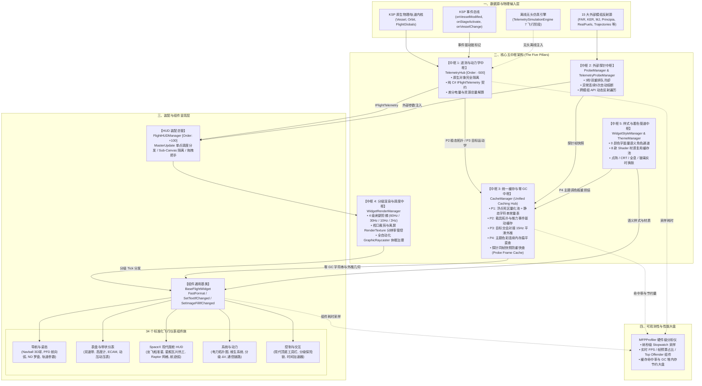
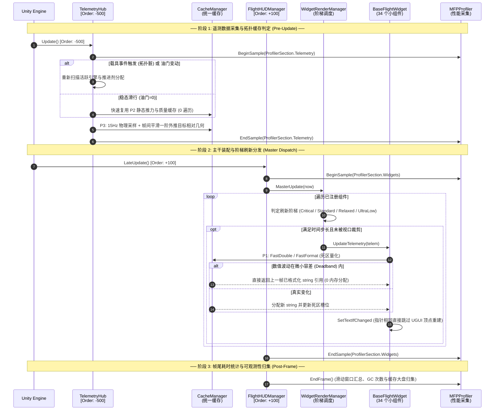
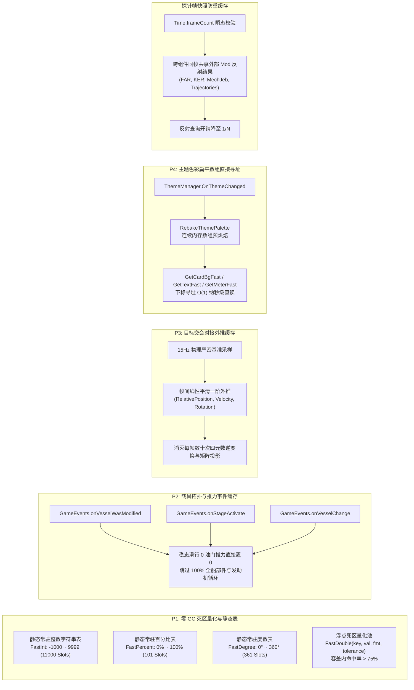
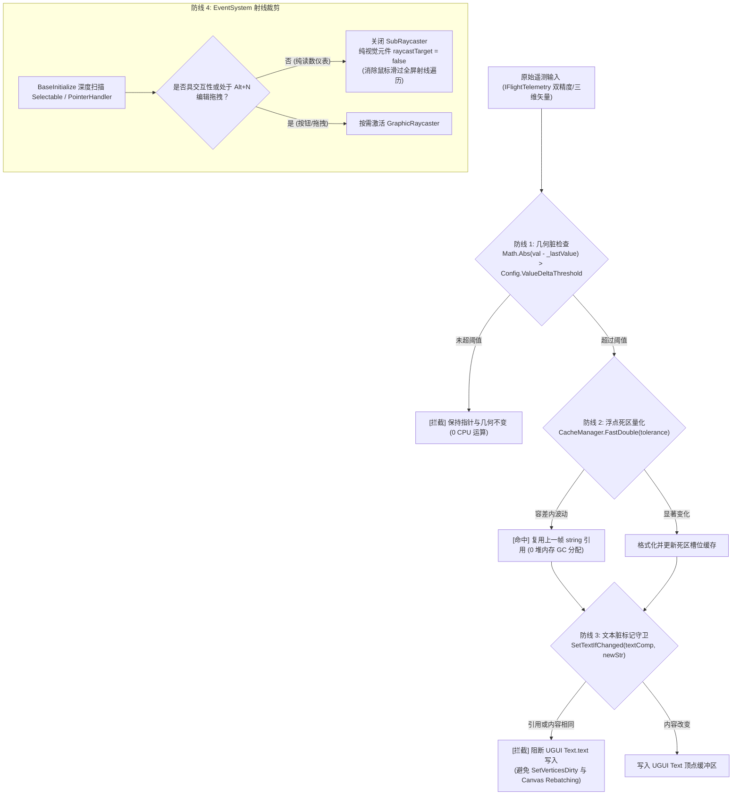
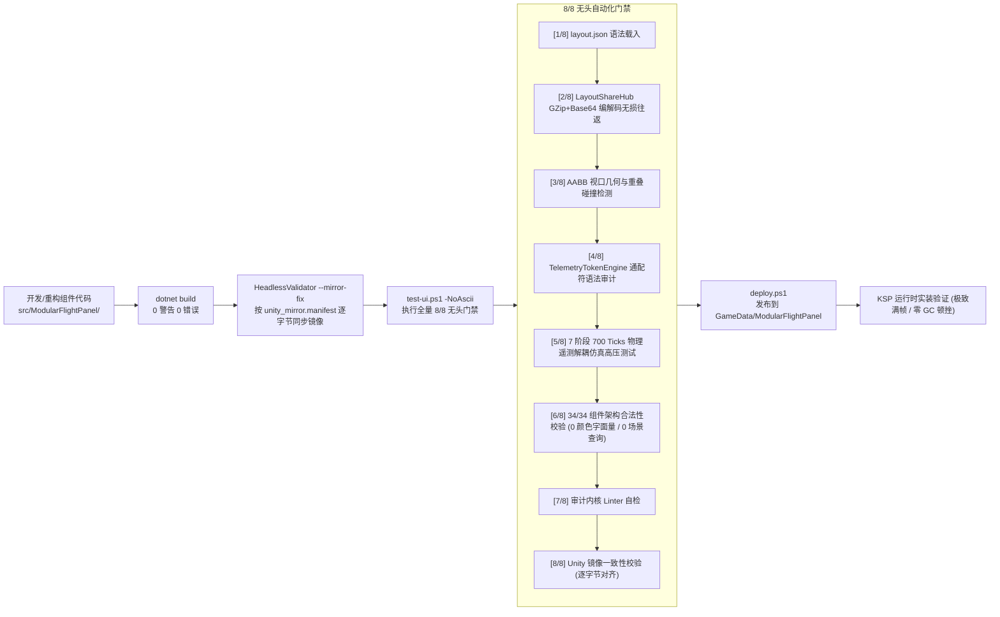

# Modular Flight Panel (MFP) 全架构全景蓝图 (Architecture Blueprint)

> **Modular Flight Panel (MFP)** 是面向 **坎巴拉太空计划 1 (KSP1 1.12.x)** 与 **Unity 2019.4 LTS** 的新一代高度解耦、全模块化、五中枢协同、100% 数据与文案通配符双驱动的飞行航电仪表系统。

---

## 1. 核心五中枢架构协同全景 (Core Five-Pillars Mesh)

MFP 彻底打破传统插件“单个脚本从头算到尾”的混沌结构，采用**严格的五中枢分离与契约化隔离**体系：



---

## 2. 全生命周期时钟与执行序编排 (Execution Order & Clock Sequence)

为杜绝采样与渲染之间的时序混乱、清零漂移与重复遍历，MFP 建立了严格的帧序锁链：



---

## 3. 统一缓存中枢 (CacheManager) 核心支柱实现拓扑



---

## 4. 小组件渲染流水线与零 GC 过滤机制 (Widget Render Pipeline)

在任何单个 `BaseFlightWidget` 内部，数据从原始遥测到 UGUI 屏幕网格的流转遵循以下**“零损耗四重防线”**：



---

## 5. 34 个全量航电小组件谱系表 (Widget Family Taxonomy)

全仓库 34 个小组件统一置于 `src/ModularFlightPanel/UI/Widgets/`，完全合规通过 8/8 无头自动化审计：

```
UI/Widgets/
├── Navigation/              # [姿态与轨道导航族]
│   ├── NavballSphereWidget        # 3D 离屏相机渲染姿态球 (节流对齐 + 静止 10Hz 降频)
│   ├── HeadingArcWidget           # PFD 航向指示弧 (Critical 60Hz)
│   ├── SASDialWidget              # 环形 SAS 航向罗盘 (Standard 30Hz)
│   ├── NDNavigationWidget         # 综合导航罗盘 (Standard 30Hz)
│   └── OrbitalInfoWidget          # 轨道根数与交会参数面板 (Relaxed 10Hz)
│
├── Gauges/                  # [表盘与垂直滚带族]
│   ├── TapeGaugeWidget            # 双侧速度 / 气压高度物理滚带 (Standard 30Hz)
│   ├── AvionicsBarGaugeWidget     # 垂直多段式动力学柱状条 (Standard 30Hz)
│   ├── ArcMeterWidget             # 弧形油门与推力百分比表 (Standard 30Hz)
│   └── EcamDialGaugeWidget        # 空客风格 ECAM 圆形指针表盘 (Standard 30Hz)
│
├── SpaceX/                  # [SpaceX 载人龙飞船与星舰航电族]
│   ├── SpaceXDockingReticleWidget # ISS 空间站对接光标 HUD (P3 运动学外推联动)
│   ├── SpaceXStarshipHudWidget    # 星舰全息平显 HUD
│   ├── SpaceXRaptorGridWidget     # 33 发动机环形推力阵列监视器
│   ├── SpaceXTileThermalWidget    # 隔热瓦表面温度热力场图
│   ├── SpaceXTrajectoryArcWidget  # 大气重返与着陆轨迹预测弧
│   ├── SpaceXAttitudeIndicatorWidget # 龙飞船触摸屏人工地平线
│   ├── SpaceXPropellantVerticalWidget # 甲烷/液氧垂直推进剂余量柱
│   ├── SpaceXMotorArcWidget       # SuperDraco 逃逸发动机推力弧
│   ├── SpaceXFlapWidget           # 前后气动翼面偏转角监视器
│   ├── SpaceXGForceWidget         # 载荷三轴过载读数卡
│   ├── SpaceXPfdRollWidget        # 滚转对齐精密微调环
│   ├── SpaceXClockWidget          # 任务发射时钟 (T- / T+)
│   ├── SpaceXDeltaVWidget         # 分级入轨 ΔV 剩余预算卡
│   └── SpaceXOverviewWidget       # 综合全船状态轮廓看板
│
├── Systems/                 # [飞船子系统与工程监视族]
│   ├── ElectricalSystemWidget     # 电力拓扑图 (GetConnectedResourceTotals 优化)
│   ├── LifeSupportWidget          # 氧气/水/气压维生环境监视 (Relaxed 10Hz)
│   ├── Rocket2DWidget             # 2D 分级轮廓剪影与级间状态 (Relaxed 10Hz)
│   ├── SignalStatusWidget         # 深空通信天线指向与天线增益 (Relaxed 10Hz)
│   ├── CommSignalWidget           # 通信数据速率与丢包率监视 (Relaxed 10Hz)
│   ├── EcamStatusWidget           # 报警备忘清单与系统状态卡 (Relaxed 10Hz)
│   └── CustomTokenTextWidget      # 自由通配符文本卡片 (100% 用户自定义)
│
└── Controls/                # [交互控制台与操纵族]
    ├── StageControlWidget         # 分级触发、倒计时与安全防误触锁 (IsInteractive)
    ├── BottomControlsWidget       # SAS / RCS / 模式快速切换底栏 (IsInteractive)
    ├── ModernToolbarWidget        # 悬浮功能呼出工具栏 (IsInteractive)
    └── TimeWarpWidget             # 时间加速倍率步进控制器 (IsInteractive)
```

---

## 6. 无头验证、镜像同步与 CI 闭环链路 (Headless CI & Verification)


