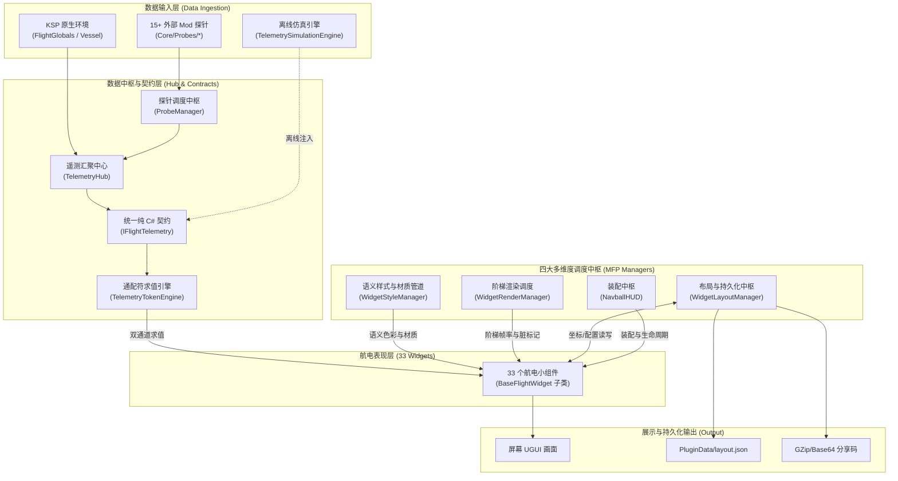

# Modular Flight Panel (MFP) 项目结构与架构全景全书

> **Modular Flight Panel (MFP / 模块化飞行面板)** 是面向 **坎巴拉太空计划 1 (KSP1 1.12.x)** 与 **Unity 2019.4 LTS** 的新一代高度解耦、全模块化、100% 数据与文案通配符双驱动的飞行仪表系统框架。

---

## 目录

1. [项目设计哲学与核心底线](#1-项目设计哲学与核心底线)
2. [顶级目录树概览](#2-顶级目录树概览)
3. [核心子系统与源码分层 (`src/`)](#3-核心子系统与源码分层-src)
   - [3.1 Core - 遥测、探针与插件内核](#31-core---遥测探针与插件内核)
   - [3.2 Config - 布局、主题与跨端分享](#32-config---布局主题与跨端分享)
   - [3.3 UI 基础中枢与审计内核](#33-ui-基础中枢与审计内核)
   - [3.4 UI/Widgets - 33 个全量航电组件全景](#34-uiwidgets---33-个全量航电组件全景)
   - [3.5 UI/Settings - 游戏内交互面板体系](#35-uisettings---游戏内交互面板体系)
4. [Unity 预览工程与着色器层 (`unity/`)](#4-unity-预览工程与着色器层-unity)
5. [发布分发与资产数据 (`GameData/`)](#5-发布分发与资产数据-gamedata)
6. [工具链与无头审计套件 (`tools/` & 根目录脚本)](#6-工具链与无头审计套件-tools--根目录脚本)
7. [数据与控制流转拓扑图](#7-数据与控制流转拓扑图)
8. [MFP-SPEC-001..007 规范门禁速查](#8-mfp-spec-001007-规范门禁速查)
9. [日常开发与验证工作流](#9-日常开发与验证工作流)

---

## 1. 项目设计哲学与核心底线

本项目坚守**全面标准化铁律（无特例、无分层妥协、禁止任何硬编码偷懒行为）**：

1. **万物皆组件 (Everything is a Widget)**：中心 3D 姿态球、弧形油门表、速度/高度数显盒、SAS 罗盘、波音 747 EICAS、SpaceX 龙飞船航电乃至用户自定义文本卡片，全部继承自 [`BaseFlightWidget`](file:///c:/Users/43701/Documents/github/KSP_naviball/src/ModularFlightPanel/UI/BaseFlightWidget.cs)。
2. **四大中枢互不越界**：
   - **样式中枢** ([`WidgetStyleManager`](file:///c:/Users/43701/Documents/github/KSP_naviball/src/ModularFlightPanel/UI/WidgetStyleManager.cs) + [`ThemeConfig`](file:///c:/Users/43701/Documents/github/KSP_naviball/src/ModularFlightPanel/Config/ThemeConfig.cs))：语义角色映射颜色与材质缓存，**组件内部 0 颜色字面量**；
   - **调度中枢** ([`WidgetRenderManager`](file:///c:/Users/43701/Documents/github/KSP_naviball/src/ModularFlightPanel/UI/WidgetRenderManager.cs))：按 `Critical(60Hz)` / `Standard(30Hz)` / `Relaxed(10Hz)` / `UltraLow(2Hz)` 阶梯分配刷新帧率，脏标记阻断无效 UI 重绘；
   - **采集与仿真中枢** ([`ProbeManager`](file:///c:/Users/43701/Documents/github/KSP_naviball/src/ModularFlightPanel/Core/ProbeManager.cs) / [`TelemetryHub`](file:///c:/Users/43701/Documents/github/KSP_naviball/src/ModularFlightPanel/Core/TelemetryHub.cs) / [`TelemetrySimulationEngine`](file:///c:/Users/43701/Documents/github/KSP_naviball/src/ModularFlightPanel/Core/TelemetrySimulationEngine.cs))：隔离 KSP 内部类，仅暴露统一抽象契约 [`IFlightTelemetry`](file:///c:/Users/43701/Documents/github/KSP_naviball/src/ModularFlightPanel/Core/IFlightTelemetry.cs)；
   - **装配中枢** ([`NavballHUD`](file:///c:/Users/43701/Documents/github/KSP_naviball/src/ModularFlightPanel/UI/NavballHUD.cs))：统一管理小组件生命周期、画布容器、拖拽把手及单点 MasterUpdate 驱动。
3. **100% 通配符双通道驱动**：
   - 数值与计量通道通过 [`TelemetryTokenEngine.EvaluateNumeric`](file:///c:/Users/43701/Documents/github/KSP_naviball/src/ModularFlightPanel/Core/TelemetryTokenEngine.cs) 计算；
   - 界面文本、状态指示、单位标签通过 [`TelemetryTokenEngine.Evaluate`](file:///c:/Users/43701/Documents/github/KSP_naviball/src/ModularFlightPanel/Core/TelemetryTokenEngine.cs) 模板热替换。
4. **单一定义规范与离线无头闭环**：
   - 规范内核 ([`WidgetSourceAudit.cs`](file:///c:/Users/43701/Documents/github/KSP_naviball/src/ModularFlightPanel/UI/WidgetSourceAudit.cs)) 跨插件与验证器共享源码单一定义；
   - 研发采用“离线改动 → 8 项无头审计全绿 → 验证镜像一致性 → 部署实装”的闭环开发模式。

---

## 2. 顶级目录树概览

```text
KSP_naviball/
├── src/                                  # C# 源码主工程
│   ├── ModularFlightPanel.sln            # Visual Studio 解决方案文件
│   └── ModularFlightPanel/               # 插件主项目 (net472)
│       ├── ModularFlightPanel.csproj     # MSBuild 工程定义与构建后自动同步配置
│       ├── Core/                         # 核心遥测、探针体系、Harmony 补丁与底层工具
│       ├── Config/                       # 主题模型、布局模型与 GZip+Base64 分享中枢
│       └── UI/                           # 航电基础框架、管理器、审计内核、设置面板与小组件库
├── unity/                                # Unity 2019.4.18f1 独立资产与离线渲染工程
│   ├── Assets/
│   │   ├── Shaders/                      # 8 款专用矢量与半色调着色器源码
│   │   ├── Editor/                       # Bundle 导出与 Batchmode 无头 UI 截图渲染器
│   │   └── ModularFlightPanel/           # 逐字节同步的源码镜像 (供独立预览渲染)
│   ├── Packages/                         # Unity 包依赖清单
│   └── ProjectSettings/                  # Unity 编辑器与图形管线设置
├── GameData/                             # KSP 游戏运行时分发目录 (产物与配置)
│   └── ModularFlightPanel/
│       ├── Plugins/                      # ModularFlightPanel.dll 编译产物
│       ├── AssetBundles/                 # modularflightpanel.ksp (Shader & 材质包)
│       ├── Themes/                       # 9 大官方与社区主题配色 JSON
│       └── PluginData/                   # 默认 layout.json、theme_settings.json、预设库与预览切片
├── tools/                                # 工具链、离线无头测试套件与同步契约
│   ├── HeadlessValidator/                # net6.0 独立 CLI 离线验证中枢
│   ├── unity_mirror.manifest             # Unity 源码镜像排除白名单契约
│   ├── test_15_probes.ps1                # 17 个外部 Mod 探针高压遍历检测脚本
│   └── migrate_semantics.py              # 语义样式批量迁移脚本
├── scripts/                              # 研发辅助辅助脚本 (同步与管线)
│   └── sync_to_unity.ps1                 # 手动镜像同步辅助工具
├── prototype/                            # 前期 Web 前端交互概念验证原型
├── scratch/                              # 逆向工程反编译对比资料、探测抓包脚本
├── test-ui.ps1                           # 【核心】环境自愈无头 8 项门禁与 Unity 渲染执行脚本
├── deploy.ps1                            # 【核心】编译并原子热替换部署到本地 KSP 实例
├── README.md                             # 项目技术规范文档
├── 项目结构.md                           # 本架构拓扑与全景结构文档
└── LICENSE                               # 开源协议 (MIT)
```

---

## 3. 核心子系统与源码分层 (`src/`)

主工程位于 [`src/ModularFlightPanel/`](file:///c:/Users/43701/Documents/github/KSP_naviball/src/ModularFlightPanel/)，面向 `.NET Framework 4.72` 与 Unity 2019.4 UGUI。

### 3.1 Core - 遥测、探针与插件内核

负责与 KSP 游戏引擎交互、调度外部数据采集、运行独立物理仿真以及通配符求值。

| 源文件 | 核心职责 | 依赖特性 |
| :--- | :--- | :--- |
| [`NavballPlugin.cs`](file:///c:/Users/43701/Documents/github/KSP_naviball/src/ModularFlightPanel/Core/NavballPlugin.cs) | `[KSPAddon]` 入口点，挂载飞行场景生命周期监控，初始化插件单例 | KSP 运行时 |
| [`HarmonyPatches.cs`](file:///c:/Users/43701/Documents/github/KSP_naviball/src/ModularFlightPanel/Core/HarmonyPatches.cs) | Harmony 补丁集合，拦截隐藏原版 Navball 并在飞行场景无缝移交控制权 | 0Harmony |
| [`IFlightTelemetry.cs`](file:///c:/Users/43701/Documents/github/KSP_naviball/src/ModularFlightPanel/Core/IFlightTelemetry.cs) | **纯 C# 遥测抽象契约接口**。定义所有速度、高度、姿态、轨道、分级 ΔV 等 50+ 字段 | 0 KSP 依赖 |
| [`TelemetryTokenEngine.cs`](file:///c:/Users/43701/Documents/github/KSP_naviball/src/ModularFlightPanel/Core/TelemetryTokenEngine.cs) | **通配符与参数求值引擎**。支持文本模板替换 (`Evaluate`) 与浮点指针值提取 (`EvaluateNumeric`) | 纯 C# / 正则 |
| [`TelemetrySimulationEngine.cs`](file:///c:/Users/43701/Documents/github/KSP_naviball/src/ModularFlightPanel/Core/TelemetrySimulationEngine.cs) | **离线高压物理仿真引擎**。实现 `IFlightTelemetry`，包含 PadHold、Ascent 等 7 大时序阶段 | 纯 C# |
| [`TelemetryHub.cs`](file:///c:/Users/43701/Documents/github/KSP_naviball/src/ModularFlightPanel/Core/TelemetryHub.cs) | 游戏侧遥测数据汇聚中心，从 `FlightGlobals.ActiveVessel` 采集原生数据并分发 | KSP 运行时 |
| [`ProbeManager.cs`](file:///c:/Users/43701/Documents/github/KSP_naviball/src/ModularFlightPanel/Core/ProbeManager.cs) | **探针统一中枢**。管控所有外部 Mod 探针的调度、双冷却 (3s)、故障熔断与安全场景搜索 | KSP 运行时 |
| [`AssetLoader.cs`](file:///c:/Users/43701/Documents/github/KSP_naviball/src/ModularFlightPanel/Core/AssetLoader.cs) | 异步/同步从 `modularflightpanel.ksp` 中提取 Shader 并在运行时重建材质 | Unity AssetBundle |
| [`MFPProfiler.cs`](file:///c:/Users/43701/Documents/github/KSP_naviball/src/ModularFlightPanel/Core/MFPProfiler.cs) | 帧时间分析器，支持 `F10` 覆盖层诊断显示与 `F11` 主逻辑旁路测试 | UGUI / IMGUI |
| [`StockNavBallHook.cs`](file:///c:/Users/43701/Documents/github/KSP_naviball/src/ModularFlightPanel/Core/StockNavBallHook.cs) | 原版姿态球矢量标记、机动节点图标与姿态轴挂钩桥梁 | KSP 姿态层 |
| [`NavballMarkerFactory.cs`](file:///c:/Users/43701/Documents/github/KSP_naviball/src/ModularFlightPanel/Core/NavballMarkerFactory.cs) | 矢量标记图标（Prograde、Retrograde、Target、Normal 等）生成与材质绑定 | UGUI |
| [`StockToolbarHook.cs`](file:///c:/Users/43701/Documents/github/KSP_naviball/src/ModularFlightPanel/Core/StockToolbarHook.cs) | 原生应用启动器 (Stock Application Launcher) 按钮挂载与状态同步 | KSP 界面层 |
| [`VesselSilhouetteBaker.cs`](file:///c:/Users/43701/Documents/github/KSP_naviball/src/ModularFlightPanel/Core/VesselSilhouetteBaker.cs) | 载具 2D 俯视/侧视正交轮廓实时离线烘焙算法 (用于载具状态图) | Camera / RT |
| [`AppPathHelper.cs`](file:///c:/Users/43701/Documents/github/KSP_naviball/src/ModularFlightPanel/Core/AppPathHelper.cs) | 跨平台路径解析辅助器 | 基础库 |

#### 探针适配子系统 (`Core/Probes/`)
负责无反射依赖或软反射兼容 15+ 热门主流 Mod，是全项目**唯一允许接触外部 Mod 类型的边界**：
- [`TelemetryProbeManager.cs`](file:///c:/Users/43701/Documents/github/KSP_naviball/src/ModularFlightPanel/Core/Probes/TelemetryProbeManager.cs)：探针自动化注册与轮询入口
- [`ProbeReflectionTraverser.cs`](file:///c:/Users/43701/Documents/github/KSP_naviball/src/ModularFlightPanel/Core/Probes/ProbeReflectionTraverser.cs)：高性能反射与类型安全遍历器
- 具体适配探针：
  - `MechJebProbe.cs`：MechJeb 自动机动与制导参量注入
  - `KerbalEngineerProbe.cs`：KER 精准多级 ΔV 与烧尽时间
  - `PrincipiaProbe.cs`：Principia 非开普勒 N 体数值积分轨道与吻切根数
  - `KerbalismProbe.cs`：Kerbalism 维生、辐射剂量与压力系统
  - `RealFuelsProbe.cs`：RealFuels 真实推进剂组分与点火压迫状态
  - `RealAntennasProbe.cs`：RealAntennas 射频通信链路、SNR 与延迟
  - `RP1AvionicsProbe.cs`：RP-1 真实航电质量与锁定状态
  - `SystemHeatProbe.cs`：SystemHeat 循环回路热力学与温控
  - `TrajectoriesProbe.cs`：Trajectories 大气再入落点与气动阻力预测
  - `FarProbe.cs`：FAR (Ferram Aerospace Research) 气动系数与跨音速阻力
  - `AtmosphereAutopilotProbe.cs`：大气自动驾驶仪攻角/侧滑角反馈
  - `DynamicBatteryStorageProbe.cs`：电池充放电功率流动态平衡
  - `GPWSProbe.cs`：近地警告系统 (Pull Up / Terrain) 语音与告警探针
  - `DockingAlignmentProbe.cs`：对准指示器角度与平移偏差
  - `TestFlightProbe.cs`：引擎可靠性、失效概率与 MTBF 数据

---

### 3.2 Config - 布局、主题与跨端分享

负责小组件几何排版持久化、主题调色板加载、样式策略解析以及紧凑字符串分享码编解码。

| 源文件 | 核心职责 |
| :--- | :--- |
| [`WidgetConfig.cs`](file:///c:/Users/43701/Documents/github/KSP_naviball/src/ModularFlightPanel/Config/WidgetConfig.cs) | **组件配置模型**。定义每个实例的 ID、类型、坐标、尺寸、旋转、通配符绑定、限幅模式 (`hard`/`soft`/`none`)、阈值等 |
| [`LayoutConfig.cs`](file:///c:/Users/43701/Documents/github/KSP_naviball/src/ModularFlightPanel/Config/LayoutConfig.cs) | 整体布局顶层结构体，包含全局缩放比与组件配置字典 |
| [`WidgetLayoutManager.cs`](file:///c:/Users/43701/Documents/github/KSP_naviball/src/ModularFlightPanel/Config/WidgetLayoutManager.cs) | 负责 `PluginData/layout.json` 的读写、保存防抖、自动备份与异常恢复 |
| [`ThemeConfig.cs`](file:///c:/Users/43701/Documents/github/KSP_naviball/src/ModularFlightPanel/Config/ThemeConfig.cs) | **主题调色板与策略模型**。包含前景色、背景色、强调色、4 级告警色及 `UiStylePolicy` 扁平化外观系数 |
| [`ThemeManager.cs`](file:///c:/Users/43701/Documents/github/KSP_naviball/src/ModularFlightPanel/Config/ThemeManager.cs) | 加载 `GameData/.../Themes/*.json` 主题，管理当前激活主题与实时热切换广播 |
| [`LayoutShareHub.cs`](file:///c:/Users/43701/Documents/github/KSP_naviball/src/ModularFlightPanel/Config/LayoutShareHub.cs) | **分享码中枢**。采用 `MFP:v1:` 协议头 + GZip 压缩 + Base64 编码，实现超 77% 体积压缩与无损往返导入导出 |

---

### 3.3 UI 基础中枢与审计内核

位于 [`src/ModularFlightPanel/UI/`](file:///c:/Users/43701/Documents/github/KSP_naviball/src/ModularFlightPanel/UI/)，奠定 MFP 航电运行的基石框架。

| 源文件 | 核心职责与规范要点 |
| :--- | :--- |
| [`BaseFlightWidget.cs`](file:///c:/Users/43701/Documents/github/KSP_naviball/src/ModularFlightPanel/UI/BaseFlightWidget.cs) | **全量小组件统一抽象基类**。内置拖拽把手、CanvasGroup 显隐、Sub-Canvas 渲染层级隔离、DPI 动态缩放乘子、生命周期管理与 `layout.json` 同步接口 |
| [`StandardFlightWidgetTemplate.cs`](file:///c:/Users/43701/Documents/github/KSP_naviball/src/ModularFlightPanel/UI/StandardFlightWidgetTemplate.cs) | **标准航电范式模板**。活的代码开发规范，严格落实五大铁律，自身 100% 通过审计，供开发者复制派生 |
| [`NavballHUD.cs`](file:///c:/Users/43701/Documents/github/KSP_naviball/src/ModularFlightPanel/UI/NavballHUD.cs) | **组件装配与画布调度总管**。挂载主 UGUI Canvas，分发装配各小组件，运行单点 MasterUpdate 驱动调度 |
| [`WidgetStyleManager.cs`](file:///c:/Users/43701/Documents/github/KSP_naviball/src/ModularFlightPanel/UI/WidgetStyleManager.cs) | **统一样式与材质着色管道**。管理 `SurfaceStyleRole`、`TextStyleRole`、`MeterStyleRole`，分发材质球与动态派生色，杜绝组件硬编码颜色 |
| [`WidgetRenderManager.cs`](file:///c:/Users/43701/Documents/github/KSP_naviball/src/ModularFlightPanel/UI/WidgetRenderManager.cs) | **分级绘制调度引擎**。管理 4 档阶梯刷新率 (Critical/Standard/Relaxed/UltraLow)，结合视口 AABB 裁剪优化帧率 |
| [`WidgetDragHandler.cs`](file:///c:/Users/43701/Documents/github/KSP_naviball/src/ModularFlightPanel/UI/WidgetDragHandler.cs) | 自由鼠标拖拽、编辑模式荧光把手显示、10px 网格对齐吸附与坐标持久化 |
| [`WidgetSelectionManager.cs`](file:///c:/Users/43701/Documents/github/KSP_naviball/src/ModularFlightPanel/UI/WidgetSelectionManager.cs) | 运行时组件多选、高亮焦点聚焦与批量位移管理器 |
| [`MarqueeSelectionHandler.cs`](file:///c:/Users/43701/Documents/github/KSP_naviball/src/ModularFlightPanel/UI/MarqueeSelectionHandler.cs) | 编辑模式下鼠标框选矩形碰撞与批量选中交互支持 |
| [`UIFactory.cs`](file:///c:/Users/43701/Documents/github/KSP_naviball/src/ModularFlightPanel/UI/UIFactory.cs) | 高性能纯代码 UGUI 元素构造工厂 (Text, Image, Panel, Slider 等)，内置像素对齐与默认材质挂载 |
| [`WidgetSourceAudit.cs`](file:///c:/Users/43701/Documents/github/KSP_naviball/src/ModularFlightPanel/UI/WidgetSourceAudit.cs) | **单一定义规范审计内核**。集成 `CSharpSourceLinter` 词法预处理器、MFP-SPEC-001..007 正则扫描、组件自动发现与规则自检 |
| [`WidgetColorLiteralAudit.cs`](file:///c:/Users/43701/Documents/github/KSP_naviball/src/ModularFlightPanel/UI/WidgetColorLiteralAudit.cs) | 颜色字面量审计规则，当前基线表全空，执行零容忍门禁 |
| [`WidgetSpecificationValidator.cs`](file:///c:/Users/43701/Documents/github/KSP_naviball/src/ModularFlightPanel/UI/WidgetSpecificationValidator.cs) | 游戏内规范验证触发入口（开发机环境自动定位源码根做源码审计，纯运行时降级为反射审计） |

---

### 3.4 UI/Widgets - 33 个全量航电组件全景

仓库现存 **33 个合规航电小组件**（32 个位于 [`UI/Widgets/`](file:///c:/Users/43701/Documents/github/KSP_naviball/src/ModularFlightPanel/UI/Widgets/)，1 个位于 [`UI/StandardFlightWidgetTemplate.cs`](file:///c:/Users/43701/Documents/github/KSP_naviball/src/ModularFlightPanel/UI/StandardFlightWidgetTemplate.cs)），分为 4 大类：

#### 1. 核心姿态与主飞行操控类 (Critical 60Hz / Standard 30Hz)
- [`NavballSphereWidget.cs`](file:///c:/Users/43701/Documents/github/KSP_naviball/src/ModularFlightPanel/UI/Widgets/NavballSphereWidget.cs)：3D 现代航电姿态球核心（支持全息、半色调、现代玻璃座舱多材质）
- [`HeadingArcWidget.cs`](file:///c:/Users/43701/Documents/github/KSP_naviball/src/ModularFlightPanel/UI/Widgets/HeadingArcWidget.cs)：PFD 罗盘航向刻度指示弧，实时俯仰与航向投影
- [`SASDialWidget.cs`](file:///c:/Users/43701/Documents/github/KSP_naviball/src/ModularFlightPanel/UI/Widgets/SASDialWidget.cs)：环形 SAS 模式选择罗盘与状态指示盘
- [`ManeuverNodeWidget.cs`](file:///c:/Users/43701/Documents/github/KSP_naviball/src/ModularFlightPanel/UI/Widgets/ManeuverNodeWidget.cs)：机动节点执行监控（烧尽倒计时、剩余 ΔV、点火时长）
- [`TapeGaugeWidget.cs`](file:///c:/Users/43701/Documents/github/KSP_naviball/src/ModularFlightPanel/UI/Widgets/TapeGaugeWidget.cs)：波音/空客通用垂直滚带表（空速带、高度带、垂直速度带）
- [`ArcMeterWidget.cs`](file:///c:/Users/43701/Documents/github/KSP_naviball/src/ModularFlightPanel/UI/Widgets/ArcMeterWidget.cs)：极坐标圆弧进度表（油门表、爬升率表、主燃料表）
- [`AvionicsBarGaugeWidget.cs`](file:///c:/Users/43701/Documents/github/KSP_naviball/src/ModularFlightPanel/UI/Widgets/AvionicsBarGaugeWidget.cs)：通用高精度航电柱状计量条

#### 2. 状态读数、推进与系统监视类 (Standard 30Hz / Relaxed 10Hz)
- [`StageDeltaVWidget.cs`](file:///c:/Users/43701/Documents/github/KSP_naviball/src/ModularFlightPanel/UI/Widgets/StageDeltaVWidget.cs)：实时分级 ΔV 列表、燃烧时间、TWR 与分级控制
- [`StageControlWidget.cs`](file:///c:/Users/43701/Documents/github/KSP_naviball/src/ModularFlightPanel/UI/Widgets/StageControlWidget.cs)：当前级分级就绪状态、分级锁与大号确认交互
- [`Rocket2DWidget.cs`](file:///c:/Users/43701/Documents/github/KSP_naviball/src/ModularFlightPanel/UI/Widgets/Rocket2DWidget.cs)：载具 2D 轮廓投影仪，展示各分级解耦状态与载具质心
- [`ElectricalSystemWidget.cs`](file:///c:/Users/43701/Documents/github/KSP_naviball/src/ModularFlightPanel/UI/Widgets/ElectricalSystemWidget.cs)：全舰电力总线监控（电荷存量、产率、消耗率与净功率流）
- [`LifeSupportWidget.cs`](file:///c:/Users/43701/Documents/github/KSP_naviball/src/ModularFlightPanel/UI/Widgets/LifeSupportWidget.cs)：Kerbalism / TAC 维生状态（氧气、水、二氧化碳、乘员生命倒计时）
- [`CommSignalWidget.cs`](file:///c:/Users/43701/Documents/github/KSP_naviball/src/ModularFlightPanel/UI/Widgets/CommSignalWidget.cs)：深空测控通信链路（地面站连接、信噪比、天线增益、延迟）
- [`SignalStatusWidget.cs`](file:///c:/Users/43701/Documents/github/KSP_naviball/src/ModularFlightPanel/UI/Widgets/SignalStatusWidget.cs)：轻量级遥测信号质量指示灯与通断状态
- [`OrbitalInfoWidget.cs`](file:///c:/Users/43701/Documents/github/KSP_naviball/src/ModularFlightPanel/UI/Widgets/OrbitalInfoWidget.cs)：轨道宏观参数卡片（远地点 AP、近地点 PE、倾角、周期）
- [`TimeWarpWidget.cs`](file:///c:/Users/43701/Documents/github/KSP_naviball/src/ModularFlightPanel/UI/Widgets/TimeWarpWidget.cs)：时间加速倍率指示、物理加速模式与快速停帧控制
- [`BottomControlsWidget.cs`](file:///c:/Users/43701/Documents/github/KSP_naviball/src/ModularFlightPanel/UI/Widgets/BottomControlsWidget.cs)：底部快捷功能控制台（RCS、SAS、齿轮、刹车、灯光总控）
- [`ModernToolbarWidget.cs`](file:///c:/Users/43701/Documents/github/KSP_naviball/src/ModularFlightPanel/UI/Widgets/ModernToolbarWidget.cs)：极简现代工具栏悬浮胶囊
- [`CustomTokenTextWidget.cs`](file:///c:/Users/43701/Documents/github/KSP_naviball/src/ModularFlightPanel/UI/Widgets/CustomTokenTextWidget.cs)：用户自定义文本卡片，零代码输入通配符模板即可生成

#### 3. 民航大型客机综合航电类 (B747 & ECAM)
- [`B747EicasWidget.cs`](file:///c:/Users/43701/Documents/github/KSP_naviball/src/ModularFlightPanel/UI/Widgets/B747EicasWidget.cs)：波音 747 上 EICAS 发动机主指示（EPR / N1 / EGT / 状态备忘），100% 数据与标签通配符驱动
- [`B747LowerEicasWidget.cs`](file:///c:/Users/43701/Documents/github/KSP_naviball/src/ModularFlightPanel/UI/Widgets/B747LowerEicasWidget.cs)：波音 747 下 EICAS 辅助指示（N2 / 燃油流量 FF / 滑油系统 / 舵面偏转）
- [`EcamDialGaugeWidget.cs`](file:///c:/Users/43701/Documents/github/KSP_naviball/src/ModularFlightPanel/UI/Widgets/EcamDialGaugeWidget.cs)：空客 A320/A350 风格圆形 ECAM 仪表盘
- [`EcamStatusWidget.cs`](file:///c:/Users/43701/Documents/github/KSP_naviball/src/ModularFlightPanel/UI/Widgets/EcamStatusWidget.cs)：ECAM 系统警告与故障检查单监视器
- [`NDNavigationWidget.cs`](file:///c:/Users/43701/Documents/github/KSP_naviball/src/ModularFlightPanel/UI/Widgets/NDNavigationWidget.cs)：现代导航综合显示屏 (Navigation Display / ND 航线罗盘)

#### 4. SpaceX 数字化大屏航电家族 (`UI/Widgets/SpaceX/`)
专为 SpaceX 载人龙飞船 (Crew Dragon) 与星舰 (Starship) 打造的一体化触控中控风格组件：
- [`SpaceXHeaderWidget.cs`](file:///c:/Users/43701/Documents/github/KSP_naviball/src/ModularFlightPanel/UI/Widgets/SpaceX/SpaceXHeaderWidget.cs)：顶部状态条（任务状态、UTC、MET 任务时钟、天体）
- [`SpaceXAttitudeWidget.cs`](file:///c:/Users/43701/Documents/github/KSP_naviball/src/ModularFlightPanel/UI/Widgets/SpaceX/SpaceXAttitudeWidget.cs)：极简数字姿态指示盒与角速度读数
- [`SpaceXArcGaugeWidget.cs`](file:///c:/Users/43701/Documents/github/KSP_naviball/src/ModularFlightPanel/UI/Widgets/SpaceX/SpaceXArcGaugeWidget.cs)：龙飞船专属圆弧平滑速度/高度仪表
- [`SpaceXEngineWidget.cs`](file:///c:/Users/43701/Documents/github/KSP_naviball/src/ModularFlightPanel/UI/Widgets/SpaceX/SpaceXEngineWidget.cs)：猛禽 (Raptor) / 默林 (Merlin) 发动机集群状态矩阵与室压监视
- [`SpaceXDockingReticleWidget.cs`](file:///c:/Users/43701/Documents/github/KSP_naviball/src/ModularFlightPanel/UI/Widgets/SpaceX/SpaceXDockingReticleWidget.cs)：空间站自动对接瞄准标尺、距离与进近轴闭环指示
- [`SpaceXTimelineWidget.cs`](file:///c:/Users/43701/Documents/github/KSP_naviball/src/ModularFlightPanel/UI/Widgets/SpaceX/SpaceXTimelineWidget.cs)：飞行任务时序里程碑时间轴（MECO、分离、入轨）
- [`SpaceXOverviewWidget.cs`](file:///c:/Users/43701/Documents/github/KSP_naviball/src/ModularFlightPanel/UI/Widgets/SpaceX/SpaceXOverviewWidget.cs)：全舰总体状态、载荷与环境简报
- [`SpaceXBottomBarWidget.cs`](file:///c:/Users/43701/Documents/github/KSP_naviball/src/ModularFlightPanel/UI/Widgets/SpaceX/SpaceXBottomBarWidget.cs)：触控式航电功能控制底栏

---

### 3.5 UI/Settings - 游戏内交互面板体系

按下 `Alt + N` 或点击工具栏图标呼出的配置中枢，位于 [`src/ModularFlightPanel/UI/Settings/`](file:///c:/Users/43701/Documents/github/KSP_naviball/src/ModularFlightPanel/UI/Settings/)：

- [`SettingsGUI.cs`](file:///c:/Users/43701/Documents/github/KSP_naviball/src/ModularFlightPanel/UI/SettingsGUI.cs)：主窗口框架调度、拖拽编辑模式总开关、缩放滑块控制
- [`TabAssembler.cs`](file:///c:/Users/43701/Documents/github/KSP_naviball/src/ModularFlightPanel/UI/Settings/TabAssembler.cs)：组件装配与属性修改面板（自由调节选中小组件的参数与通配符）
- [`TabWidgetManager.cs`](file:///c:/Users/43701/Documents/github/KSP_naviball/src/ModularFlightPanel/UI/Settings/TabWidgetManager.cs)：小组件列表库、新建卡片、删除与显隐开关
- [`TabLibrary.cs`](file:///c:/Users/43701/Documents/github/KSP_naviball/src/ModularFlightPanel/UI/Settings/TabLibrary.cs)：开箱即用小组件模板库
- [`TabThemeSettings.cs`](file:///c:/Users/43701/Documents/github/KSP_naviball/src/ModularFlightPanel/UI/Settings/TabThemeSettings.cs)：主题选择器、样式策略滑块（描边强弱、毛玻璃透明度、辉光度）
- [`TabSharePresets.cs`](file:///c:/Users/43701/Documents/github/KSP_naviball/src/ModularFlightPanel/UI/Settings/TabSharePresets.cs)：预设载入与一键生成/导入分享码
- [`TabSimulation.cs`](file:///c:/Users/43701/Documents/github/KSP_naviball/src/ModularFlightPanel/UI/Settings/TabSimulation.cs)：离线仿真模式触发与实时遥测注入控制
- [`TelemetryCatalog.cs`](file:///c:/Users/43701/Documents/github/KSP_naviball/src/ModularFlightPanel/UI/Settings/TelemetryCatalog.cs)：游戏内通配符词典大全，供玩家直接查阅与点击复制

---

## 4. Unity 预览工程与着色器层 (`unity/`)

独立的 Unity 2019.4.18f1 工程，用于离线构建 Shader AssetBundle 以及执行纯 Batchmode 无头 UI 截图渲染。

### 4.1 着色器资产 (`unity/Assets/Shaders/`)

| Shader 名称 | 风格与表现特性 |
| :--- | :--- |
| `ModularFlightPanel/NavballModern` | 现代玻璃座舱风格姿态球：平滑梯度天顶/地平线、精密刻度梯、边缘微光 |
| `ModularFlightPanel/NavballHalftone` | 赛博向量示波器风格：点阵半色调 (Dither) 渐变与 CRT 扫描线 |
| `ModularFlightPanel/NavballProcedural` | 高性能全程序化姿态球着色器：无外部贴图依赖，极坐标网格动态绘制 |
| `ModularFlightPanel/NavballEnhanced` | 原版 Navball 材质增强通道 |
| `ModularFlightPanel/RadialSegmentedMeter` | 极坐标弧形分段表条：油门、过载、爬升率段落高亮 |
| `ModularFlightPanel/GlassCockpitUI` | 现代磨砂玻璃质感边框、环境模糊反光与微光槽 |
| `ModularFlightPanel/NeonGlowUI` | 切角科技感线框、荧光辉光与告警跳闪 |
| `ModularFlightPanel/DigitalSegmentUI` | 经典 7 段 / 14 段 LED 数码管数字管硬件模拟效果 |
| `ModularFlightPanel/DotMatrixUI` | 工业级点阵字符翻牌显示屏模拟效果 |
| `ModularFlightPanel/PhosphorHoloUI` | 绿色荧光管全息雷达光栅效果 |

### 4.2 编辑器构建工具 (`unity/Assets/Editor/`)

- [`BuildAssetBundles.cs`](file:///c:/Users/43701/Documents/github/KSP_naviball/unity/Assets/Editor/BuildAssetBundles.cs)：一键将所有 Shader 编译为 KSP 专用的 `AssetBundles/modularflightpanel.ksp`。
- [`HeadlessUIRenderer.cs`](file:///c:/Users/43701/Documents/github/KSP_naviball/unity/Assets/Editor/HeadlessUIRenderer.cs)：**无头离线预览渲染中枢**。脱离 KSP 客户端，直接由 Unity Batchmode 启动，加载布局配置与仿真数据，瞬间生成 1080P 全屏截图或指定单个组件的隔离透明切片。

### 4.3 源码同步镜像 (`unity/Assets/ModularFlightPanel/`)

根据 [`tools/unity_mirror.manifest`](file:///c:/Users/43701/Documents/github/KSP_naviball/tools/unity_mirror.manifest) 契约，自动镜像排除 KSP 依赖（探针、Harmony、运行时插件、设置 GUI），保持其余核心代码 100% 逐字节一致，实现 Unity 编辑器内的开箱即用编译。

---

## 5. 发布分发与资产数据 (`GameData/`)

最终打包分发给玩家的文件组织：

```text
GameData/ModularFlightPanel/
├── Plugins/
│   └── ModularFlightPanel.dll            # 插件主核心 DLL
├── AssetBundles/
│   └── modularflightpanel.ksp            # 编译后的 Shader 与材质包二进制
├── Themes/                               # 9 大内置主题方案
│   ├── modern_aero.json                  # Modern Glass Cockpit (冰蓝纯白波音风)
│   ├── cyber_neon.json                   # Cyber Neon (高反差青/绿/洋红赛博风)
│   ├── classic_aero.json                 # Classic Aero (经典蓝棕原版复刻)
│   ├── apollo_1969.json                  # Apollo 1969 AGC (阿波罗登月舱绿色荧光管)
│   ├── apollo_dsky.json                  # Apollo DSKY (阿波罗数字显示键盘经典黑绿琥珀)
│   ├── cyber_matrix.json                 # Matrix Green (矩阵流光黑客绿)
│   ├── diffractive_hud.json              # 衍射平显 (F-35 衍射全息绿)
│   ├── spacex_dragon.json                # SpaceX 龙飞船触控极简深色主题
│   └── vintage_amber.json                # 复古琥珀工业终端风
└── PluginData/
    ├── layout.json                       # 玩家当前激活的航电组件布局
    ├── theme_settings.json               # 玩家当前激活的主题设置与样式系数
    ├── Presets/                          # 6 款官方出厂推荐预设
    │   ├── 01_Default_Avionics.json      # 经典航电标准布局
    │   ├── 02_Modern_Glass_Cockpit.json  # 现代双联屏玻璃座舱布局
    │   ├── 03_Apollo_Retro_Moon.json     # 阿波罗复古登月布局
    │   ├── 04_Deep_Space_Probe.json      # 深空探测器长效监视布局
    │   ├── 05_SpaceX_Dragon_Cockpit.json # 龙飞船三联屏座舱布局
    │   └── 05_SpaceX_Starship_HUD.json   # 星舰超大平显 HUD 布局
    └── isolated_*.png                    # 各小组件由无头渲染器生成的离线预览图
```

---

## 6. 工具链与无头审计套件 (`tools/` & 根目录脚本)

项目配备了一整套保障代码质量、杜绝架构漂移的自动化门禁工具链：

### 6.1 无头验证器 ([`tools/HeadlessValidator/`](file:///c:/Users/43701/Documents/github/KSP_naviball/tools/HeadlessValidator/))
基于 `.NET 6.0` 独立的 CLI 命令行程序，直接引用编译插件源码中的 [`WidgetSourceAudit.cs`](file:///c:/Users/43701/Documents/github/KSP_naviball/src/ModularFlightPanel/UI/WidgetSourceAudit.cs) 与 [`WidgetColorLiteralAudit.cs`](file:///c:/Users/43701/Documents/github/KSP_naviball/src/ModularFlightPanel/UI/WidgetColorLiteralAudit.cs)，杜绝规则副本漂移。

### 6.2 根目录双驱动脚本

- [`test-ui.ps1`](file:///c:/Users/43701/Documents/github/KSP_naviball/test-ui.ps1)：
  - **环境自愈**：自动检测并补齐丢失的系统关键环境变量，定位本机 `dotnet.exe`；
  - **无头验证**：运行全量 8 项测试门禁（布局、分享码、AABB、Token、仿真、规范、自检、镜像）；
  - **Batchmode 离线渲染**：带 `-Render` 参数调用原生 Unity 2019，生成 1080P 或单组件离线渲染图。
- [`deploy.ps1`](file:///c:/Users/43701/Documents/github/KSP_naviball/deploy.ps1)：
  - 自动触发插件 Release 构建；
  - 完整同步 `GameData/ModularFlightPanel` 资产与 DLL；
  - 针对运行中被 KSP 锁定的 DLL 采用 **NTFS 原子更名替换 (Atomic Rename Swap)**，杜绝文件占用报错。

---

## 7. 数据与控制流转拓扑图



---

## 8. MFP-SPEC-001..007 规范门禁速查

全项目由单一内核 [`WidgetSourceAudit.cs`](file:///c:/Users/43701/Documents/github/KSP_naviball/src/ModularFlightPanel/UI/WidgetSourceAudit.cs) 严格强制执行：

| 规则编码 | 规范名称 | 检查逻辑与防范违规 |
| :--- | :--- | :--- |
| **MFP-SPEC-001** | 组件继承基类 | 必须继承 [`BaseFlightWidget`](file:///c:/Users/43701/Documents/github/KSP_naviball/src/ModularFlightPanel/UI/BaseFlightWidget.cs)，禁止私建独立 MonoBehaviour 游离在装配管线外 |
| **MFP-SPEC-002** | 显式刷新阶梯 | 必须显式重写 `RefreshTier` (`Critical` / `Standard` / `Relaxed` / `UltraLow`)，严禁组件内部写死 Update 轮询节流 |
| **MFP-SPEC-003** | 主题样式接入 | 必须实现 `ApplyTheme(ThemeConfig)`，样式与颜色必须委托给 `WidgetStyleManager` |
| **MFP-SPEC-004** | 遥测契约驱动 | 必须实现 `OnUpdateTelemetry(IFlightTelemetry)`，严禁直接触碰 KSP 内部静态单例 |
| **MFP-SPEC-005** | 安全析构闭环 | `OnDestroy` 必须为 `protected override` 且内部必须调用 `base.OnDestroy()`，严禁 `private` 隐藏基类析构导致内存泄漏 |
| **MFP-SPEC-006** | 零颜色字面量 | **零容忍门禁**。严禁出现 `new Color(...)`、`Color.white` 等任何颜色字面量（唯一白名单豁免为 `Color.clear`） |
| **MFP-SPEC-007** | 零场景实时查询 | 严禁在组件中使用 `FindObjectOfType`、`GameObject.Find` 等高开销场景全量查询，统统走 `ProbeManager` 双冷却代理 |

---

## 9. 日常开发与验证工作流

```powershell
# ==============================================================================
# 1. 运行离线全量无头验证（八项检查 + 预设库扫描；全绿退出码 0）
# ==============================================================================
pwsh ./test-ui.ps1 -NoAscii

# 指定自定义布局或分享码测试
pwsh ./test-ui.ps1 -File "GameData\ModularFlightPanel\PluginData\Presets\02_Modern_Glass_Cockpit.json"
pwsh ./test-ui.ps1 -Code "MFP:v1:H4sIAAAAAAAACu2Ya2/aSBSG/wqyVKkrBTq+jC98M..."

# ==============================================================================
# 2. 检查或修复 Unity 工程源码镜像一致性 (修改任何被镜像的文件后必跑)
# ==============================================================================
dotnet run --project tools/HeadlessValidator -- --mirror-check    # 校验镜像一致性
dotnet run --project tools/HeadlessValidator -- --mirror-fix      # 一键同步修复镜像

# ==============================================================================
# 3. 运行 Native Unity 2019 Batchmode 离线 UI 渲染切片 (无需启动游戏)
# ==============================================================================
pwsh ./test-ui.ps1 -Render                                       # 渲染当前全屏 1080P
pwsh ./test-ui.ps1 -Render -Widget "custom.b747_eicas"           # 隔离渲染单个指定组件

# ==============================================================================
# 4. 编译并部署到本地 KSP 实例 (支持运行中原子热替换)
# ==============================================================================
pwsh ./deploy.ps1
```
